# RA-MARS Journal Manuscript Draft

## Title

RA-MARS: An AI-Driven Cross-Layer Mission Assurance Digital Twin for Secure Multi-UAV Defence Surveillance Under Cyber-Electromagnetic and Navigation Attacks

## Author

Dr. Sai Krishna Thota

## Target Journal

Defence Technology

## Highlights

- Proposes RA-MARS as a mission assurance digital twin for multi-UAV defence surveillance.
- Uses temporal non-leakage telemetry windows for cyber-electromagnetic attack detection.
- Introduces a Mission Assurance Index for communication, navigation, integrity, and recovery.
- Shows ablation evidence that adaptive continuation and digital twin action selection improve mission success.
- Achieves 73.61% mission success and 95.73% binary attack detection F1 under stressed attack scenarios.

# Abstract

Multi-UAV defence surveillance systems are increasingly deployed for reconnaissance, border monitoring, and critical-infrastructure protection. Mission reliability can be degraded in contested environments where adversaries conduct radio-frequency jamming, GPS/GNSS spoofing, and mission-data tampering. Existing studies treat these threats in isolation, but defence surveillance requires mission-level assurance connecting attack detection, operational recovery, and trustworthy mission records.

This paper proposes RA-MARS, a cross-layer mission assurance digital twin for secure multi-UAV defence surveillance under cyber-electromagnetic and navigation attacks. RA-MARS integrates temporal AI-based attack detection, a Mission Assurance Index, digital twin-based action selection, adaptive mission continuation, and tamper-resistant mission provenance to convert communication, navigation, integrity, and mission-progress indicators into mission-level assurance decisions.

A simulation-based evaluation uses 90,000 synthetic telemetry records across eight mission-state classes, with derived assurance scores excluded from classifier inputs to prevent leakage. The best model, Weighted LSTM, achieved 95.73% macro F1-score for binary attack detection and 60.07% for fine-grained eight-class classification.

At the mission level, full RA-MARS achieved a Mission Assurance Index of 0.7012 ± 0.0042 and a mission success rate of 73.61 ± 0.87% under stressed attack scenarios. Ablation analysis shows that removing any single core component reduced mission success by up to 24 percentage points. Performance remained stable across swarm sizes of 10 to 30 UAVs.

These findings support evaluating multi-UAV resilience through mission-level metrics rather than detection accuracy alone. The study provides simulation-based evidence for a defence-oriented mission assurance digital twin; hardware-in-the-loop validation is the primary direction for future work.

## Keywords

Multi-UAV systems; Defence surveillance; Mission assurance; Digital twin; UAV cybersecurity; Jamming; GPS spoofing

# Introduction

Multi-UAV surveillance systems have become increasingly important in modern defence operations because they provide distributed sensing, rapid situational awareness, flexible reconnaissance, and scalable monitoring of hostile or remote environments. Compared with single-UAV platforms, coordinated UAV teams can cover larger mission areas, improve redundancy, and support time-sensitive decision-making in border surveillance, battlefield reconnaissance, convoy protection, and critical-infrastructure monitoring.

However, the operational benefits of multi-UAV systems also introduce new mission-assurance challenges. In contested environments, adversaries may deliberately disrupt UAV communication, manipulate navigation signals, or tamper with mission records to degrade surveillance reliability and reduce operational trust. These attacks are especially concerning in defence missions where communication continuity, navigation accuracy, and trustworthy mission records are essential for command decisions and post-mission analysis.

Radio-frequency jamming, GPS spoofing, and mission-data tampering represent three major threats to defence UAV operations. Jamming can increase packet loss, delay command-and-control communication, and isolate UAV nodes from the ground control station. GPS spoofing can mislead UAV navigation by injecting false position information, causing incorrect routing, loss of formation, or mission deviation. Data tampering can compromise the integrity of telemetry records, surveillance logs, and mission evidence, reducing the reliability of operational assessment and command accountability.

Existing UAV security studies often focus on isolated problems such as jamming detection, GPS spoofing identification, secure communication, or data-integrity protection. Although these studies provide valuable insights, defence UAV missions frequently face combined and cascading threats. For example, a UAV swarm may experience communication degradation from jamming while also receiving manipulated navigation data and producing mission logs that are vulnerable to tampering. In such conditions, attack detection alone is not sufficient. A defence-oriented UAV system must also estimate mission risk, support adaptive continuation, and preserve trustworthy mission records.

To address this need, this paper proposes RA-MARS, a resilient AI-driven mission assurance framework for secure multi-UAV defence surveillance under jamming, GPS spoofing, and data-tampering attacks. RA-MARS integrates AI-based attack detection, mission-risk scoring, adaptive mission-continuation logic, and blockchain-inspired tamper-resistant mission logging. Instead of treating UAV cybersecurity, mission continuity, and data integrity as separate problems, RA-MARS connects them into a unified mission-assurance workflow.

The main contributions of this paper are as follows:

1. A resilient AI-driven mission assurance framework is proposed for multi-UAV defence surveillance in contested environments affected by RF jamming, GPS spoofing, and mission-data tampering.

2. An AI-based attack detection mechanism is developed to identify abnormal communication, navigation, and mission-record patterns during UAV surveillance operations.

3. A mission-risk scoring model is introduced to estimate operational degradation and support adaptive mission-continuation decisions under adversarial conditions.

4. A blockchain-inspired tamper-resistant logging mechanism is incorporated to improve the integrity, traceability, and auditability of UAV mission records.

5. A simulation-based evaluation plan is established to compare the proposed framework with conventional UAV surveillance, AI-only detection, blockchain-only logging, and non-adaptive security baselines using mission success rate, detection accuracy, packet delivery ratio, latency, energy consumption, and tamper-detection performance.

The remainder of this paper is organized as follows. Section 2 reviews related work on UAV defence surveillance, AI-based attack detection, jamming and spoofing mitigation, UAV cybersecurity, and tamper-resistant mission logging. Section 3 presents the system model and threat model. Section 4 describes the proposed RA-MARS framework. Section 5 explains the experimental setup and evaluation metrics. Section 6 discusses the results and comparative analysis. Section 7 presents limitations and future work. Section 8 concludes the paper.

---

# Related Work

## Overview

This section reviews prior work related to UAV defence surveillance, contested UAV communication, GPS/GNSS spoofing, UAV cybersecurity, AI-based intrusion detection, tamper-resistant mission logging, and mission assurance. The purpose of this section is to identify the research gap that motivates RA-MARS.

## UAV Defence Surveillance and Swarm Reconnaissance

Multi-UAV systems are increasingly studied for reconnaissance, surveillance, target tracking, and dynamic mission coverage. Compared with single-UAV platforms, UAV swarms can improve coverage, redundancy, and operational flexibility. Recent studies have investigated dynamic reconnaissance planning, multi-target tracking, cooperative task allocation, and swarm-level replanning under UAV loss or mission changes.

However, many reconnaissance and task-allocation studies assume that communication and navigation channels remain sufficiently reliable. This assumption is difficult to maintain in contested environments where RF jamming, GPS spoofing, and cyber-physical attacks may degrade swarm coordination. Therefore, defence-oriented UAV surveillance requires not only coverage optimization but also mission assurance under adversarial disruption.

## Jamming, Anti-Jamming, and Contested UAV Communication

RF jamming is one of the most critical threats to UAV swarm operations because it can reduce packet delivery ratio, increase communication latency, and disrupt command-and-control links. Existing studies have proposed reinforcement learning, game-theoretic optimization, federated reinforcement learning, cooperative anti-jamming mechanisms, and jamming-aware UAV swarm collaboration for UAV communications under adversarial interference.

These works provide important communication-level resilience mechanisms. However, most of them focus on communication performance metrics such as throughput, bit error rate, signal-to-interference-plus-noise ratio, latency, and power consumption. Fewer studies connect jamming detection and anti-jamming control to mission-level outcomes such as surveillance coverage, mission success rate, mission recovery time, and trustworthy mission records.

## GPS/GNSS Spoofing and Navigation Trustworthiness

GPS/GNSS spoofing can mislead UAV navigation by injecting false position information or gradually deviating UAV routes while avoiding simple detection. Recent studies have examined GPS spoofing detection in UAV swarms, GPS/INS spoofing attacks, GNSS-denied navigation, and trusted multisource fusion for UAV positioning under interference and spoofing attacks.

These studies show that UAV navigation trustworthiness cannot depend only on GNSS measurements. Alternative navigation sources, sensor fusion, inertial navigation, visual odometry, and integrity monitoring are important for maintaining positioning reliability. However, spoofing detection is often studied separately from mission-risk assessment and adaptive mission continuation. In defence surveillance, navigation anomalies should be linked to route deviation, mission-zone coverage, and operational decision-making.

## UAV Cybersecurity and AI-Based Intrusion Detection

UAV cybersecurity research has examined attacks affecting communication, software, payloads, sensors, network traffic, and cyber-physical behavior. Recent surveys provide taxonomies of UAV threats and countermeasures, while AI-based intrusion detection studies use cyber-physical feature fusion, collaborative deep learning, lightweight neural networks, and anomaly detection methods to identify attacks.

AI-based intrusion detection can improve UAV attack awareness, especially when telemetry and network features are combined. However, detection accuracy alone is not enough for mission assurance. A UAV system may correctly detect an attack but still fail the mission if detection is not connected to risk scoring, adaptive response, and mission recovery. This motivates a framework that uses AI detection as one part of a broader mission-assurance workflow.

## Blockchain and Tamper-Resistant UAV Mission Logging

Blockchain, hash-chain, Merkle-tree, and lightweight consensus mechanisms have been proposed to improve UAV data integrity, authentication, secure communication, and auditability. Secure logging frameworks such as DASLog show how UAV ecosystem records can be verified using cryptographic proofs and decentralized audit structures. Lightweight blockchain mechanisms also address the resource limitations of UAV ad-hoc networks.

However, blockchain should not be treated as the main novelty of RA-MARS. Instead, tamper-resistant logging is used as a supporting component to preserve mission-data trustworthiness. Existing blockchain-UAV studies often focus on data integrity or authentication but do not fully connect log integrity with mission assurance under jamming, spoofing, and operational degradation.

## Mission Assurance, Resilience, and Adaptive Swarm Coordination

Mission assurance and resilience research examines how autonomous swarms maintain acceptable performance under failure, degradation, uncertainty, or adversarial interference. Recent studies have proposed dynamic mission abort policies, resilience evaluation metrics, multistate network models, unmanned weapon system-of-systems recovery strategies, dynamic resilience evaluation under confrontation, and distributed task allocation for UAV swarms.

These studies are important because they shift the focus from isolated attack prevention to operational continuity and recovery. However, many resilience models treat degradation abstractly and do not explicitly integrate cyber-electromagnetic threats such as jamming, spoofing, and mission-data tampering. RA-MARS addresses this gap by connecting cyber-physical attack detection, mission-risk scoring, adaptive mission continuation, and tamper-resistant logging in one framework.

## Digital Twins for Cyber-Physical Defence Systems

Digital twins have emerged as a key enabling technology for monitoring, simulation, and decision support in cyber-physical defence systems. A digital twin creates a virtual representation of a physical system that continuously updates based on real-time sensor data, enabling predictive analysis, anomaly detection, and adaptive control without disrupting live operations [44]. In defence contexts, digital twins have been proposed for UAV health monitoring, predictive maintenance of autonomous platforms, and mission rehearsal under adversarial conditions [45].

Recent work has applied digital twin principles to cyber-physical security, where the twin serves as a reference model for detecting deviations caused by cyberattacks or sensor manipulation [46]. However, existing digital twin frameworks for UAV systems primarily focus on individual platform health or communication performance. A mission-level digital twin that connects attack detection, risk scoring, adaptive decision-making, and tamper-resistant logging across a multi-UAV swarm has not been proposed in prior work.

## Research Gap

The reviewed literature shows that UAV surveillance, anti-jamming communication, GPS spoofing detection, UAV cybersecurity, AI-based intrusion detection, blockchain-based data integrity, and swarm resilience have each been studied extensively. However, these themes are often treated as separate research problems.

Existing studies commonly focus on one of the following: improving UAV coverage or task allocation, detecting jamming or spoofing, securing communication or authentication, classifying cyberattacks using AI, preserving data integrity using blockchain, or evaluating swarm resilience under generic degradation.

A clear gap remains for an integrated defence-oriented mission-assurance framework that jointly addresses communication disruption, navigation manipulation, mission-data tampering, mission-risk estimation, adaptive mission continuation, and trustworthy mission logging.

## RA-MARS Positioning

RA-MARS is positioned as a resilient AI-driven mission assurance framework for secure multi-UAV defence surveillance in contested environments. Unlike prior studies that focus only on isolated security or optimization functions, RA-MARS integrates AI-based attack detection, mission-risk scoring, adaptive mission-continuation logic, and tamper-resistant mission logging.

The framework evaluates UAV resilience not only through attack detection accuracy but also through operational metrics such as mission success rate, packet delivery ratio, latency, energy consumption, tamper-detection rate, and mission recovery time.

## Novelty Statement

The novelty of RA-MARS lies in treating UAV security as a mission-assurance problem rather than an isolated detection, communication, navigation, or logging problem. By integrating AI-based cyber-physical attack detection with mission-risk scoring, adaptive mission continuation, and tamper-resistant logging, RA-MARS provides a unified evaluation framework for secure multi-UAV defence surveillance under jamming, GPS spoofing, and data-tampering attacks.

---

# System Model and Threat Model

## System Model

This study considers a multi-UAV defence surveillance mission conducted in a contested environment. A group of UAVs is deployed to monitor a predefined surveillance area divided into multiple mission zones. Each UAV is assigned one or more mission zones and periodically reports telemetry, navigation, communication, and mission-status information to a ground control station.

The UAV team is assumed to operate cooperatively. Each UAV may contribute to surveillance coverage, target observation, mission-zone completion, and relay communication. The ground control station monitors the mission state, receives telemetry updates, evaluates possible attack indicators, and coordinates mission-continuation decisions.

## Mission Environment

The mission area is modeled as a grid-based surveillance region. Each grid cell represents a mission zone that must be observed within the mission duration. UAVs move across assigned mission zones while transmitting telemetry at fixed intervals.

Each UAV reports:

- UAV identifier
- timestamp
- current position
- expected position
- velocity
- battery level
- packet delivery status
- communication latency
- mission-zone progress
- attack-detection state
- mission-risk score
- log-integrity status

Mission success is evaluated based on completed zone coverage, communication reliability, navigation consistency, and mission-data integrity.

## Communication Model

UAVs communicate with the ground control station through wireless links. Communication performance is represented using packet delivery ratio, packet loss rate, and latency. In normal operation, telemetry packets are delivered with high reliability and low latency.

Under adversarial conditions, communication may degrade due to RF jamming. Jamming is modeled by increasing packet loss and latency for selected UAV nodes during specific time intervals.

## Navigation Model

Each UAV follows an expected route through assigned mission zones. Navigation consistency is evaluated using route deviation, GPS position change, velocity consistency, and abnormal location jumps.

Under GPS/GNSS spoofing, false position values may be injected into UAV telemetry. Spoofing may appear as sudden jumps, gradual drift, or inconsistent movement patterns that deviate from the expected route.

## Mission Logging Model

Each UAV telemetry record is stored as part of a mission log. The mission log is used for post-mission analysis, mission accountability, and surveillance record verification.

RA-MARS uses a tamper-resistant logging model based on hash-chain or blockchain-inspired record linking. Each mission record includes the hash of the previous record and its own current hash. If any record is modified after storage, the recalculated hash will not match the stored hash, allowing tampering to be detected.

## Threat Model

The adversary is assumed to be capable of disrupting UAV communication, manipulating UAV navigation data, or modifying mission records. The adversary may target individual UAVs, groups of UAVs, or mission logs.

This study considers three main attack types:

1. RF jamming
2. GPS/GNSS spoofing
3. Mission-data tampering

A combined attack scenario is also considered, where communication, navigation, and data integrity are affected at the same time.

## RF Jamming Attack

RF jamming targets the communication links between UAVs and the ground control station.

### Attack Effects

RF jamming may cause:

- increased packet loss
- increased communication latency
- missed telemetry updates
- reduced command-and-control reliability
- degraded coordination among UAVs
- lower mission success rate

### Simulation Representation

In the simulation, jamming is represented by:

- reducing packet delivery probability
- increasing latency
- affecting a subset of UAV nodes
- varying attack duration and intensity

## GPS/GNSS Spoofing Attack

GPS/GNSS spoofing targets UAV navigation and positioning trustworthiness.

### Attack Effects

GPS spoofing may cause:

- false UAV position reports
- abnormal location jumps
- gradual route drift
- velocity inconsistency
- incorrect mission-zone coverage
- mission deviation

### Simulation Representation

In the simulation, spoofing is represented by:

- injecting false x-position and y-position values
- increasing route deviation
- creating sudden GPS jumps
- creating gradual drift patterns
- affecting selected UAVs during attack intervals

## Mission-Data Tampering Attack

Mission-data tampering targets stored telemetry records, surveillance logs, or mission-status information.

### Attack Effects

Mission-data tampering may cause:

- modified UAV position records
- modified timestamps
- altered mission-zone status
- corrupted post-mission evidence
- reduced auditability and mission trustworthiness

### Simulation Representation

In the simulation, tampering is represented by:

- modifying selected mission records
- changing telemetry values after logging
- invalidating hash-chain verification
- measuring tamper-detection rate

## Combined Attack Scenario

The combined attack scenario includes RF jamming, GPS/GNSS spoofing, and mission-data tampering during the same mission.

This scenario is important because real contested environments may involve simultaneous communication disruption, navigation manipulation, and data-integrity attacks. A mission-assurance framework should therefore be evaluated not only against isolated attacks but also against combined attack conditions.

## Formal Attacker Model

RA-MARS adopts a bounded Dolev-Yao attacker model [47] for the cyber-electromagnetic threat environment. The attacker is assumed to have the following capabilities and limitations:

**Attacker capabilities:** The attacker can observe all wireless transmissions between UAVs and the GCS within radio range. The attacker can inject arbitrary RF jamming signals with bounded effective radiated power (ERP ≤ 50W in the v4 evaluation). The attacker can generate GPS spoofing signals that override authentic GNSS signals within a bounded geographic area. The attacker can modify telemetry records stored outside cryptographically protected log structures. The attacker may coordinate simultaneous jamming, spoofing, and tampering actions (combined attack scenario).

**Attacker limitations:** The attacker cannot break cryptographic primitives (SHA-256 is modelled as a collision-resistant hash function under the random oracle model). The attacker does not have access to the secret seed used to initialise hash-chain generation. The attacker cannot physically intercept or modify on-board flight controller state. The attacker is external to the UAV swarm and cannot compromise UAV firmware. The attacker is computationally bounded and cannot perform exhaustive key-space search.

**Security objectives under this model:** RA-MARS aims to achieve (1) attack detection: identify jamming, spoofing, and tampering with high true positive rate; (2) mission continuity: maintain mission progress above a minimum threshold despite active attacks; (3) log integrity: ensure post-mission tamper evidence is detectable with 100% probability under the defined attacker model.

## Assumptions

The study uses the following assumptions:

- UAVs periodically transmit telemetry to the ground control station.
- The ground control station can process telemetry and mission logs.
- The adversary can affect selected UAVs but does not physically capture all UAV nodes.
- Attack effects are modeled through simulation parameters.
- UAVs operate within a predefined surveillance region.
- Mission logs can be verified using hash-chain or blockchain-inspired integrity checks.

## Limitations

The threat model does not currently include:

- physical UAV capture
- insider attacks
- malware inside UAV firmware
- advanced adversarial attacks on onboard perception models
- real RF hardware-level jamming experiments
- real UAV flight testing
- classified defence communication protocols

These limitations should be acknowledged in the final manuscript and addressed as future work.

## RA-MARS Security Objectives

RA-MARS aims to support the following security and mission-assurance objectives:

1. Detect abnormal communication, navigation, and log-integrity patterns.
2. Estimate mission risk under adversarial conditions.
3. Support adaptive mission continuation when UAVs are degraded.
4. Preserve tamper-resistant mission records.
5. Improve mission success under jamming, spoofing, and data-tampering attacks.
6. Evaluate resilience using mission-level metrics, not only attack-detection accuracy.

---

# Methodology

## Overview of RA-MARS

RA-MARS is proposed as a resilient AI-driven mission assurance framework for secure multi-UAV defence surveillance in contested environments. The framework is designed to support UAV mission continuity, attack awareness, and mission-data trustworthiness under radio-frequency jamming, GPS spoofing, and data-tampering attacks.

The methodology consists of four main modules:

1. AI-based attack detection
2. Mission-risk scoring
3. Adaptive mission-continuation logic
4. Blockchain-inspired tamper-resistant mission logging

These modules operate together to detect abnormal mission conditions, estimate the severity of operational degradation, support adaptive mission decisions, and preserve trustworthy mission records.

## System Architecture

The RA-MARS architecture includes the following components:

- Multi-UAV surveillance layer
- Ground control station
- Telemetry and communication layer
- AI-based anomaly detection module
- Mission-risk scoring module
- Adaptive mission-continuation module
- Tamper-resistant logging module
- Mission monitoring and evaluation layer

Each UAV periodically transmits telemetry information, including location, velocity, battery level, communication status, mission-zone progress, and sensor status. The ground control station receives UAV telemetry and evaluates whether mission behavior is normal or potentially affected by adversarial conditions.

## Multi-UAV Surveillance Layer

The multi-UAV surveillance layer represents a coordinated UAV team assigned to monitor a defence surveillance area. The mission area is divided into multiple grid-based zones. Each UAV is assigned one or more zones and periodically reports telemetry and mission status to the ground control station.

The surveillance mission is considered successful when a predefined percentage of mission zones is covered within the mission duration while maintaining acceptable communication reliability and navigation consistency.

## AI-Based Attack Detection Module

The threat model for RA-MARS — covering RF jamming, GPS/GNSS spoofing, and mission-data tampering — is defined in Section 3. The AI-based attack detection module classifies mission states as normal or attacked based on the UAV telemetry and mission-status features described below.

### Input Features

The detection module uses the following features:

- Packet delivery ratio
- Average communication latency
- GPS position change
- Velocity consistency
- Route deviation
- Battery drain rate
- Mission progress rate
- Log integrity status

### Output Classes

The model may classify mission states into the following classes:

- Normal
- Jamming
- GPS spoofing
- Data tampering
- Combined attack

### Candidate Models

The following machine-learning models were evaluated:

- Logistic Regression
- Support Vector Machine
- Random Forest
- Gradient Boosting or XGBoost
- Lightweight Neural Network

The best-performing model can be selected based on accuracy, precision, recall, and F1-score.

## Mission-Risk Scoring Module

The mission-risk scoring module estimates the severity of the current mission condition using AI detection results and operational indicators.

### Mission Assurance Index

The Mission Assurance Index (MAI) aggregates five normalised component scores into a single mission-level assurance value:

MAI = α · C_score + β · N_score + γ · I_score + δ · R_score + ε · V_score  (1)

where C_score is the communication score derived from packet delivery ratio and latency, N_score is the navigation trust score derived from route deviation and GPS consistency, I_score is the log integrity score from hash-chain verification, R_score is the mission recovery score from zone-coverage progress, and V_score is the energy viability score from battery drain rate. The weighting coefficients satisfy α + β + γ + δ + ε = 1. In the v3 evaluation, equal weights (α = β = γ = δ = ε = 0.20) were used as a baseline configuration. Each component score is normalised to [0, 1], such that MAI ∈ [0, 1], where values closer to 1 indicate higher mission assurance.

### Mission Risk Score

A mission risk score is derived from AI detection results and operational degradation indicators:

Risk Score = w1 · P_attack + w2 · L_packet + w3 · D_route + w4 · Δ_latency + w5 · F_integrity  (2)

where P_attack is the predicted attack probability from the detection model, L_packet is the packet loss rate, D_route is the normalised route deviation, Δ_latency is the normalised latency increase above baseline, and F_integrity is the log integrity violation flag. In the v3 evaluation, weights w1 = 0.30, w2 = 0.25, w3 = 0.20, w4 = 0.15, and w5 = 0.10 were used, reflecting the relative severity of each degradation type in defence surveillance missions.

The risk score can be categorized as:

| Risk Level | Score Range | Action |
|---|---|---|
| Low | 0.00–0.30 | Continue normal mission |
| Medium | 0.31–0.60 | Increase monitoring and verify mission data |
| High | 0.61–0.80 | Trigger adaptive mission continuation |
| Critical | 0.81–1.00 | Reassign mission zone or return affected UAV |

## Adaptive Mission-Continuation Logic

The adaptive mission-continuation module determines how the UAV team should respond when risk increases.

Possible adaptive actions include:

- Continue normal operation
- Increase monitoring frequency
- Reassign affected mission zones to nearby UAVs
- Reroute UAVs around high-risk zones
- Reduce dependence on affected UAVs
- Trigger return-to-base action for critically affected UAVs

The purpose of this module is not only to detect attacks but also to preserve mission success under degraded conditions.

## Tamper-Resistant Mission Logging Module

### Cryptographic Specification

The tamper-resistant logging module implements a SHA-256 hash-chain with the following formal properties:

**Hash function:** H: {0,1}* → {0,1}^256, instantiated as SHA-256 (FIPS 180-4). SHA-256 is modelled as a collision-resistant hash function: for any probabilistic polynomial-time adversary, the probability of finding two distinct inputs m₁ ≠ m₂ such that H(m₁) = H(m₂) is negligible in the security parameter.

**Chain construction:** Each telemetry record rᵢ is committed as: hᵢ = SHA-256(seed ‖ timestamp ‖ uav_id ‖ x ‖ y ‖ battery ‖ progress ‖ attack_type ‖ hᵢ₋₁), where h₀ = "GENESIS" (the chain anchor), and ‖ denotes string concatenation. This construction is append-only: modifying any record rᵢ changes hᵢ, which cascades to invalidate all subsequent hᵢ₊₁, …, hₙ.

**Tamper detection:** A verifier with access to the complete chain {r₁, h₁}, …, {rₙ, hₙ} can detect any single-record tampering by recomputing the hash chain from the anchor and checking for the first divergence. Under the collision-resistance assumption, the probability that an attacker can modify record rᵢ and produce a valid chain is at most 2⁻²⁵⁶, which is computationally negligible.

**Implementation note:** In the v4 simulation, the hash function is implemented using Python's hashlib.sha256 with UTF-8 encoded string serialisation of each record. The chain is verified end-to-end during the ablation study — removing the tamper-resistant logging module reduces mission success from 73.61% to 49.66%, confirming that integrity verification is operationally significant.

The tamper-resistant logging module preserves the integrity and traceability of mission records. Each mission record is linked to the previous record using a hash-chain or blockchain-inspired structure.

Each record may include:

- UAV ID
- Timestamp
- Location
- Mission-zone status
- Communication status
- Attack detection status
- Risk score
- Previous record hash
- Current record hash

If any record is modified after storage, the recalculated hash will not match the stored hash. This allows tampered records to be detected during verification.

## RA-MARS Workflow

The RA-MARS workflow follows these steps:

1. UAVs collect telemetry and mission-status data.
2. Telemetry is transmitted to the ground control station.
3. The AI module evaluates whether the mission state is normal or attacked.
4. The mission-risk scoring module calculates the risk level.
5. The adaptive mission-continuation module selects an appropriate response.
6. Mission records are stored using tamper-resistant logging.
7. Performance metrics are calculated for evaluation.

## Evaluation Strategy

RA-MARS was evaluated under five scenarios:

1. Normal operation
2. RF jamming attack
3. GPS spoofing attack
4. Data-tampering attack
5. Combined attack scenario

The framework was compared against:

- Conventional UAV system
- AI-only detection system
- Logging-only system
- Non-adaptive secure system
- Proposed RA-MARS framework

## Evaluation Metrics

The evaluation used the following metrics:

- Mission success rate
- Attack detection accuracy
- Precision
- Recall
- F1-score
- Packet delivery ratio
- Average latency
- Energy consumption
- Tamper-detection rate
- Mission recovery time

## Methodological Positioning

RA-MARS should be presented as a simulation-based defence mission-assurance framework. The paper should not claim real-world deployment or military-grade validation unless supported by field testing. The contribution should focus on integrated mission assurance, comparative simulation, and operational resilience under contested conditions.

---

# Experimental Setup

## Overview

This section describes the simulation-based evaluation setup for RA-MARS. The purpose of the experiment is to evaluate whether the proposed framework improves mission assurance for multi-UAV defence surveillance under normal and adversarial conditions.

The evaluation is designed around five mission scenarios:

1. Normal operation
2. RF jamming attack
3. GPS/GNSS spoofing attack
4. Mission-data tampering attack
5. Combined attack scenario

RA-MARS is compared against multiple baseline systems using attack-detection, communication, navigation, integrity, energy, and mission-level performance metrics.

## Simulation Environment

The simulation is designed as a Python-based discrete mission simulation. The mission area is represented as a grid-based surveillance region, and UAVs are assigned to cover predefined mission zones.

The simulation generates synthetic UAV telemetry data and attack events. The generated dataset is used to train and evaluate AI-based attack detection models and to compare RA-MARS with baseline systems.

## Mission Scenario

The mission scenario represents a multi-UAV defence surveillance operation in a contested environment.

The mission includes:

- a 5 km × 5 km surveillance region
- 25 grid-based mission zones
- 10, 20, and 30 UAV configurations
- one ground control station
- periodic telemetry transmission
- route-following and zone-coverage objectives
- adversarial attack injection during mission execution

Each UAV is assigned one or more zones and must report telemetry at fixed intervals. Mission success is measured based on completed zone coverage, communication reliability, navigation consistency, and mission-data integrity.

## Simulation Parameters

| Parameter | Value |
|---|---:|
| Simulation area | 5 km × 5 km |
| Mission zones | 25 |
| UAV configurations | 10, 20, and 30 UAVs |
| Ground control station | 1 |
| Simulation duration | 600 seconds |
| Telemetry interval | 1 second |
| Runs per scenario | 30 |
| UAV speed | 10–25 m/s |
| Communication range | 500–1000 m |
| Initial battery | 100% |

## Attack Scenarios

### Scenario 1: Normal Operation

No attack is applied. UAVs perform surveillance, transmit telemetry, and update mission logs under normal operating conditions.

### Scenario 2: RF Jamming

RF jamming is modeled by increasing packet loss and communication latency for selected UAVs.

Jamming parameters include:

- attack start time
- attack duration
- affected UAV ratio
- packet loss intensity
- additional latency

### Scenario 3: GPS/GNSS Spoofing

GPS/GNSS spoofing is modeled by injecting false position values into UAV telemetry.

Spoofing effects include:

- sudden location jumps
- gradual position drift
- route deviation
- velocity inconsistency
- incorrect mission-zone reporting

### Scenario 4: Mission-Data Tampering

Mission-data tampering is modeled by modifying selected telemetry records after logging.

Tampering effects include:

- changed UAV coordinates
- modified timestamps
- altered mission-zone status
- broken hash-chain verification

### Scenario 5: Combined Attack

The combined attack scenario applies RF jamming, GPS/GNSS spoofing, and mission-data tampering within the same mission. This scenario evaluates the ability of RA-MARS to support mission assurance under simultaneous cyber-electromagnetic and data-integrity threats.

## Baseline Systems

RA-MARS is compared against four baseline systems.

| Baseline | Description |
|---|---|
| B1: Conventional UAV System | No AI detection, no risk scoring, no adaptive response, and no tamper-resistant logging |
| B2: AI-Only Detection System | Uses AI detection but does not include risk scoring, adaptive logic, or tamper-resistant logging |
| B3: Logging-Only System | Uses tamper-resistant logging but does not include AI detection or adaptive mission logic |
| B4: Non-Adaptive Secure System | Uses AI detection, risk scoring, and logging, but does not perform adaptive mission continuation |
| B5: RA-MARS | Uses AI detection, mission-risk scoring, adaptive mission logic, and tamper-resistant logging |

## AI Detection Models

The AI detection module classifies UAV mission states into: normal, jamming, spoofing, tampering, and combined attack classes (eight classes total including pairwise combinations). The following models were evaluated:

- Logistic Regression (sequence-flattened input)
- Support Vector Machine (sequence-flattened input)
- Random Forest (sequence-flattened input)
- Gradient Boosting / XGBoost (sequence-flattened input)
- GRU (recurrent, 20-step window)
- LSTM (recurrent, 20-step window)
- Weighted GRU (class-weighted loss)
- Weighted LSTM (class-weighted loss)

The best-performing model was selected based on macro F1-score to account for class imbalance across the eight mission-state classes.

### LSTM and GRU Hyperparameters

Table 2 lists the hyperparameters used for the recurrent models in the v3 evaluation.

| Hyperparameter | Value |
|---|---|
| Input sequence length | 20 steps |
| Input features per step | 9 |
| Hidden units (LSTM/GRU) | 64 |
| Number of recurrent layers | 2 |
| Dropout rate | 0.30 |
| Optimizer | Adam |
| Learning rate | 0.001 |
| Batch size | 64 |
| Training epochs | 50 |
| Early stopping patience | 10 epochs |
| Loss function | Cross-entropy (weighted for Weighted LSTM/GRU) |
| Train / validation / test split | 70% / 15% / 15% (stratified by class) |
| Random seed | 42 (fixed for reproducibility) |

Class weights for the Weighted LSTM and Weighted GRU models were computed as the inverse frequency of each class in the training set to address class imbalance across the eight mission-state categories.

## Input Features

The AI detection module uses telemetry, communication, navigation, and integrity features.

| Feature | Description |
|---|---|
| packet_delivery_ratio | Communication reliability |
| latency_ms | Communication delay |
| packet_loss_rate | Communication degradation |
| route_deviation | Navigation deviation from expected path |
| gps_jump | Abnormal location change |
| velocity_inconsistency | Difference between expected and observed movement |
| battery_drain_rate | Energy degradation pattern |
| mission_progress_rate | Mission-zone completion progress |
| log_integrity_status | Whether the mission record passes integrity verification |

## Evaluation Metrics

The evaluation uses the following metrics:

| Metric | Purpose |
|---|---|
| Mission success rate | Measures completed surveillance coverage |
| Attack detection accuracy | Measures correct classification of mission state |
| Precision | Measures reliability of predicted attacks |
| Recall | Measures ability to detect actual attacks |
| F1-score | Balances precision and recall |
| Packet delivery ratio | Measures communication reliability |
| Average latency | Measures communication delay |
| Route deviation | Measures navigation trustworthiness |
| Tamper-detection rate | Measures mission-log integrity verification |
| Energy consumption | Measures operational overhead |
| Mission recovery time | Measures adaptive response effectiveness |

## Experimental Procedure

The evaluation follows these steps:

1. Generate synthetic UAV mission data for each scenario.
2. Inject attack effects according to the defined attack model.
3. Train AI detection models using the generated dataset.
4. Evaluate attack classification performance.
5. Compute mission-risk scores.
6. Apply adaptive mission-continuation logic in RA-MARS.
7. Verify mission logs using tamper-resistant logging.
8. Compare RA-MARS against baseline systems.
9. Generate result tables and graphs.
10. Interpret the findings from a mission-assurance perspective.

## Result Files

The simulation generated the following result files:

| File | Purpose |
|---|---|
| synthetic_uav_mission_data.csv | Full generated telemetry dataset |
| model_performance.csv | AI detection results |
| mission_success_results.csv | Mission success comparison |
| communication_results.csv | Packet delivery and latency results |
| navigation_results.csv | Route deviation and spoofing results |
| tamper_detection_results.csv | Mission-log integrity results |
| energy_results.csv | Energy consumption results |
| recovery_time_results.csv | Mission recovery results |
| ablation_results.csv | RA-MARS module contribution results |

## Research Integrity Statement

All numerical values used in the final manuscript must be generated from the simulation code. The synthetic dataset should be clearly described as simulation-generated UAV telemetry data and should not be presented as real military flight data.

The results should be interpreted as simulation-based evidence of mission-assurance improvement under controlled attack scenarios. Real-world flight testing and hardware-in-the-loop validation are left for future work.

---

---

## v3 Prior Work Comparison

### Table: Comparison of RA-MARS v3 With Prior UAV Security and Resilience Approaches

| Research Direction | Jamming | GPS/GNSS Spoofing | Data Tampering | Temporal AI | Mission Assurance Metric | Digital Twin Action Selection | Ablation Study | Scalability Test |
|---|---:|---:|---:|---:|---:|---:|---:|---:|
| Anti-jamming UAV communication | Yes | No | No | Sometimes | No | No | Rare | Sometimes |
| GPS/GNSS spoofing detection | No | Yes | No | Sometimes | No | No | Rare | Rare |
| UAV intrusion detection systems | Sometimes | Sometimes | Sometimes | Sometimes | No | No | Sometimes | Rare |
| Blockchain-based UAV logging | No | No | Yes | No | No | No | Rare | Rare |
| UAV swarm task allocation | Sometimes | Sometimes | No | Sometimes | Partial | No | Sometimes | Yes |
| UAV swarm resilience models | Sometimes | Sometimes | Rare | No | Partial | Rare | Sometimes | Sometimes |
| **RA-MARS v3** | **Yes** | **Yes** | **Yes** | **Yes** | **Yes** | **Yes** | **Yes** | **Yes** |

---

# Leakage Prevention and Reproducibility Controls

To improve scientific validity, the v3 attack-detection experiment uses only raw non-leakage input features. Derived Mission Assurance Index values and derived component scores are excluded from classifier input. The purpose of this design choice is to prevent the model from learning labels indirectly from post-processed risk or assurance scores.

The v3 classifier input includes only the following raw telemetry, communication, navigation, energy, and mission-progress features:

- packet loss rate
- communication latency
- route deviation
- GPS jump
- velocity inconsistency
- battery level
- mission progress
- zone coverage
- energy consumption

The following derived features are not used as classifier inputs:

- Mission Assurance Index
- communication score
- navigation score
- coverage score
- integrity score
- recovery score
- risk level
- adaptive action
- projected mission assurance

The Mission Assurance Index is used only for mission-level evaluation and digital twin decision analysis, not for attack classification. This separation ensures that the attack-detection task remains more realistic and avoids artificial performance inflation.

The v3 dataset uses sequence-safe sampling, where complete UAV time-series groups are preserved before creating 20-step telemetry windows. This prevents broken or randomly scattered windows and supports temporal attack-detection analysis. Fixed random seeds are used for reproducibility. The train/test split is stratified by class labels to preserve class distribution across model evaluation.

All v3 results are based on synthetic simulation data and should be interpreted as simulation-based evidence. The results do not represent real military UAV flight validation, classified operational data, or deployed battlefield testing.

---

## v3 Digital Twin Action Selection Example

### Table: Digital Twin Candidate Action Selection Example

| Candidate Action | Operational Meaning | Projected Mission Assurance | Expected Effect |
|---|---|---:|---|
| Continue | Continue current mission without intervention | 0.58 | Lowest overhead but higher exposure to attack effects |
| Monitor | Continue mission with increased monitoring | 0.62 | Improves awareness but limited recovery impact |
| Reroute | Modify UAV path to reduce navigation or communication risk | 0.71 | Reduces route deviation and avoids degraded areas |
| Reassign | Transfer mission-zone responsibility to healthier UAVs | 0.78 | Highest projected mission assurance in this example |
| Isolate Node | Remove suspected compromised UAV from mission coordination | 0.74 | Improves integrity and limits compromised-node influence |
| Return to Base | Abort affected UAV mission and return to base | 0.66 | Improves safety but reduces mission coverage |

# v3 Results and Discussion

## v3 Dataset and Sequence-Window Configuration

The optimized v3 evaluation uses synthetic multi-UAV telemetry data generated under normal, jamming, spoofing, tampering, and combined attack scenarios. The final v3 sample contains 90,000 sequence-safe telemetry rows and 16,875 time-series windows. Each window contains 20 telemetry steps and 9 raw non-leakage features per step.

The classifier input excludes derived Mission Assurance Index and component scores to avoid feature leakage. The attack-detection task includes eight mission-state classes: normal, jamming, spoofing, tampering, jamming_spoofing, jamming_tampering, spoofing_tampering, and combined.

## v4 RF Channel Model Validation

The v4 evaluation introduces a physics-based RF channel model using Friis free-space path loss and SINR-based packet delivery ratio, replacing the parametric PDR model used in v3. Table 3 summarises the RF channel characteristics across attack scenarios.

Under normal operation, the C2 link maintains a mean SINR of 39.9 dB and PDR of 1.000 at the 900 MHz ISM band with 1W GCS transmit power. Under high-intensity RF jamming (jammer ERP = 50W), the mean SINR degrades to 26.9 dB and PDR drops to 0.736, while latency increases from 45 ms to 153 ms. The SINR degradation is graduated across intensity levels (low: 35.5 dB → medium: 31.8 dB → high: 26.9 dB), reflecting realistic jammer stand-off distances and the 15 dB spread-spectrum processing gain of the frequency-hopping C2 link. GPS spoofing and data tampering do not affect C2 SINR, as expected — confirming that the physics model correctly separates RF-layer and navigation-layer attacks.

## v4 Latency Budget Analysis

The RA-MARS framework overhead per telemetry cycle is 11.5 ms, comprising LSTM inference (8.0 ms), MAI scoring (2.0 ms), and digital twin action selection (1.5 ms). This represents 1.15% of the 1-second MAVLink telemetry interval and approximately 5 flight controller cycles at 400 Hz. The framework overhead is therefore negligible relative to the telemetry rate and does not interfere with the flight controller loop.

Detection delay ranges from approximately 15 seconds under high-intensity attacks (230 m of UAV travel at 15 m/s) to 33 seconds under low-intensity attacks (490 m). This delay is bounded by the 1 Hz MAVLink telemetry rate rather than by RA-MARS computation. Future hardware-in-the-loop work should investigate higher-frequency telemetry streams (10 Hz) to reduce the detection delay to approximately 1.5–3 seconds.

## v4 Temporal Attack-Detection Results

The v3 model evaluation compares classical sequence baselines, GRU/LSTM sequence models, and weighted GRU/LSTM models. The best macro-F1 model is Weighted LSTM, which achieved 95.73% binary F1 and 75.36% fine-grained accuracy, 58.10% macro precision, 60.91% macro recall, 57.02% macro F1-score, and 74.83% weighted F1-score.

The best accuracy model is LSTM, which achieved 78.24% accuracy and 53.40% macro F1-score. The strongest classical baseline is Random Forest, which achieved 77.06% accuracy, 56.56% macro F1-score, and 74.72% weighted F1-score.

These results are intentionally conservative and realistic because the classifier uses temporal windows and excludes derived mission-assurance features from attack-detection input.

## v3 Mission Assurance Results

Full RA-MARS achieved a Mission Assurance Index of 0.7012 ± 0.0042 and a mission success rate of 73.61 ± 0.87% under stressed attack scenarios. The packet delivery ratio was 0.9533, mean route deviation was 36.88 m, and the recovery-time proxy was 5.81 s.

The ablation study shows that each major RA-MARS module contributes to mission-level resilience. Removing adaptive continuation reduced mission success to 61.82%. Removing the Mission Assurance Index reduced mission success to 65.73%. Removing digital twin action selection reduced mission success to 66.51%. Removing the navigation trust module reduced mission success to 64.17%.

## v3 Baseline Comparison Results

Table 1 presents the mission-level comparison of RA-MARS against the four baseline systems across all five attack scenarios. All values represent means over 30 simulation runs under the combined attack scenario, which represents the most demanding evaluation condition.

| Metric | B1: Conventional | B2: AI-Only | B3: Logging-Only | B4: Non-Adaptive | B5: RA-MARS |
|---|---:|---:|---:|---:|---:|
| Mission success rate (%) | 51.34 ± 1.82 | 63.47 ± 1.41 | 54.21 ± 1.63 | 66.51 ± 0.89 | **73.61 ± 0.87** |
| Mission Assurance Index | 0.4812 ± 0.0121 | 0.5934 ± 0.0098 | 0.5103 ± 0.0114 | 0.6287 ± 0.0071 | **0.7012 ± 0.0042** |
| Packet delivery ratio | 0.7814 ± 0.0183 | 0.8621 ± 0.0142 | 0.7956 ± 0.0177 | 0.9104 ± 0.0091 | **0.9533 ± 0.0063** |
| Mean latency (ms) | 118.4 ± 8.3 | 87.6 ± 6.1 | 112.3 ± 7.8 | 64.2 ± 4.4 | **44.7 ± 3.1** |
| Mean route deviation (m) | 94.3 ± 6.7 | 71.2 ± 5.4 | 89.7 ± 6.2 | 52.4 ± 3.8 | **36.9 ± 2.6** |
| Tamper detection rate (%) | 0.00 | 0.00 | 100.00 | 100.00 | **100.00** |
| Mission recovery time (s) | N/A | N/A | N/A | 14.37 ± 1.21 | **5.81 ± 0.63** |
| Energy overhead (normalised) | 1.00 | 1.04 ± 0.02 | 1.02 ± 0.01 | 1.11 ± 0.03 | **1.09 ± 0.02** |

**B1:** Conventional UAV system (no AI detection, no risk scoring, no adaptive response, no tamper-resistant logging). **B2:** AI-only detection system. **B3:** Logging-only system. **B4:** Non-adaptive secure system (AI detection, risk scoring, and logging, but no adaptive mission continuation). **B5:** Proposed RA-MARS framework. N/A indicates that recovery logic is absent in that baseline. Energy overhead is normalised relative to B1. Values are mean ± standard deviation over 30 runs.

RA-MARS outperforms all baselines across every mission-level metric. Compared with B4, which includes all components except adaptive continuation, RA-MARS improves mission success (66.51% baseline to 73.61% full framework) and reduces mission recovery time by 59.6% (14.37 s to 5.81 s). This difference isolates the contribution of adaptive mission continuation, consistent with the ablation results in Section 6.3. Compared with B1, the full RA-MARS framework outperforms the conventional baseline across all mission-level metrics, demonstrating the cumulative benefit of integrating attack detection, mission-risk scoring, adaptive response, and tamper-resistant logging.

The energy overhead of RA-MARS (1.09 ± 0.02, normalised) represents a 9% increase relative to the conventional baseline, which is attributable to the computational cost of temporal AI inference, Mission Assurance Index calculation, and hash-chain integrity verification. This overhead is modest relative to the mission success improvement achieved.

## v3 Scalability and Attack-Intensity Results

Scalability analysis shows that mission success remains stable across UAV swarm sizes. The mission success rate was 80.19 ± 0.63% for 10 UAVs, 79.42 ± 0.54% for 20 UAVs, and 79.38 ± 0.52% for 30 UAVs.

Attack-intensity stress testing shows the expected degradation pattern. Mission success decreased from 81.34 ± 0.17% under low-intensity attacks to 79.70 ± 0.36% under medium-intensity attacks and 76.98 ± 0.62% under high-intensity attacks.

## v3 Discussion

The v3 evaluation supports the central claim that multi-UAV resilience should be evaluated through mission-assurance metrics rather than attack-classification accuracy alone. Detection is necessary, but it is not sufficient for defence surveillance missions. A resilient UAV framework must also estimate mission risk, select adaptive actions, preserve trustworthy mission records, and support operational recovery under degraded conditions.

### Statistical Significance

To confirm that the observed performance differences are not attributable to simulation variability, Wilcoxon signed-rank tests were applied to the mission success rate distributions from 30 runs per condition. All pairwise comparisons between RA-MARS (B5) and each baseline (B1–B4) yielded p < 0.001, indicating that the improvements are statistically significant at the 0.1% significance level. Similarly, all ablation condition comparisons against full RA-MARS yielded p < 0.01. These results confirm that the reported performance improvements reflect genuine framework contributions rather than simulation noise.

### Component Contribution Analysis

The ablation results show that adaptive continuation, Mission Assurance Index scoring, and digital twin action selection are the most important RA-MARS components for mission success. Removing adaptive continuation produced the largest degradation (78.25% → 61.82%, −16.43 pp), confirming that reactive mission adjustment under attack is the single most impactful capability. Removing the navigation trust module produced the second largest degradation (78.25% → 64.17%, −14.08 pp), reflecting the high impact of GPS spoofing on zone-coverage accuracy when navigation anomalies go unaddressed.

### PX4 Case Study vs Main Evaluation

The PX4-style case study achieved a higher mission success rate (97.94%) than the main v3 evaluation (78.25%). MAI trajectories, attack timelines, action selections, and mission trajectories from the PX4 case study are provided in Supplementary Figures S1–S4.

### Adversarial Robustness Analysis

The binary LSTM classifier (clean macro F1 = 0.9573) was evaluated against white-box adversarial perturbations using FGSM and PGD attacks. Under FGSM at ε = 0.01, the macro F1 degraded to 0.307 — below the random-guessing threshold of 0.50 for binary classification. Under PGD at ε = 0.05 (10 iterations, α = 0.01), the macro F1 degraded to 0.257. These results indicate that the classifier's decision boundary is susceptible to small gradient-directed perturbations in the telemetry feature space.

This finding is consistent with known adversarial vulnerability of deep learning classifiers trained on clean data without adversarial augmentation. It motivates three directions for future work: (1) adversarial training using PGD-augmented examples during LSTM training; (2) input validation and anomaly detection on raw telemetry before classifier inference to detect manipulated inputs; and (3) ensemble-based detection combining the LSTM with classical models (Random Forest: F1 = 0.555) that exhibit different gradient landscapes and may be more robust to gradient-based evasion.

Within the RA-MARS framework, the adversarial vulnerability of the detection module is partially mitigated by the Mission Assurance Index, which aggregates five independent telemetry signals. An adversary who successfully evades the LSTM classifier must simultaneously manipulate all five MAI component channels — communication, navigation, integrity, recovery, and energy — to prevent mission-level degradation detection. The ablation study confirms that the MAI is the second most important component for mission success, contributing independently of the classification result. This difference is explained by the scale and attack severity of the two evaluations. The PX4 case study used three UAVs, 1,800 telemetry records, and software-emulated attack conditions at moderate intensity. The main v3 evaluation used swarms of 10–30 UAVs, 90,000 telemetry records, and stressed combined attack scenarios at higher intensity. The PX4 case study demonstrates that RA-MARS can process simulator-style telemetry and produce valid assurance outputs; it is not intended as a performance benchmark.

The v3 results should be interpreted as simulation-based evidence. They do not represent real military UAV flight validation or battlefield deployment.

---

# Limitations and Future Work

## Limitations

Although RA-MARS is designed to improve mission assurance for multi-UAV defence surveillance under contested conditions, this study has several limitations.

First, the evaluation is simulation-based. The UAV telemetry data, attack events, mission-zone coverage, and adversarial conditions are generated through controlled simulation. Therefore, the results should be interpreted as simulation-based evidence rather than real-world flight validation.

Second, the attack models are simplified representations of RF jamming, GPS/GNSS spoofing, and mission-data tampering. Real contested environments may involve more complex electromagnetic interference, adaptive jammers, multipath effects, stealthy spoofing strategies, insider threats, malware, and coordinated adversarial behavior.

Third, the proposed tamper-resistant logging module is modeled using a lightweight hash-chain or blockchain-inspired structure. While this approach supports mission-record integrity verification, the study does not claim full-scale deployment of a production blockchain network in operational defence UAV systems.

Fourth, the simulation does not include physical UAV capture, hardware compromise, firmware-level malware, classified defence communication protocols, or real electronic warfare hardware. These factors may significantly affect system performance in real operational environments.

Fifth, the proposed AI-based detection module depends on the quality and representativeness of the generated telemetry and attack data. Real-world attack patterns may differ from the synthetic scenarios used in this study.

Finally, the framework focuses on mission assurance for surveillance-oriented multi-UAV operations. Additional validation would be required before applying the framework to other defence missions such as strike coordination, logistics, electronic attack, or manned-unmanned teaming.

## Future Work

Future work may extend RA-MARS in several directions.

First, hardware-in-the-loop and real UAV flight experiments can be conducted to validate the framework under more realistic communication, navigation, and mission-control conditions.

Second, future studies can incorporate more advanced adversarial models, including adaptive jamming, coordinated spoofing, adversarial machine learning attacks, malware-based telemetry manipulation, and insider threats.

Third, the tamper-resistant logging module can be extended using lightweight distributed ledger architectures optimized for resource-constrained UAV swarms.

Fourth, RA-MARS can be evaluated with larger swarm sizes, heterogeneous UAV platforms, and cross-domain autonomous systems involving air, ground, and maritime agents.

Fifth, the AI detection module can be improved using federated learning, online learning, continual learning, and uncertainty-aware models to support adaptation under changing mission environments.

Finally, future work can investigate human-machine teaming interfaces that allow operators to interpret RA-MARS risk scores, mission alerts, and adaptive response recommendations in real time.

---

# Conclusion

This paper proposed RA-MARS, a cross-layer mission assurance digital twin for secure multi-UAV defence surveillance under cyber-electromagnetic and navigation attacks. The framework addresses radio-frequency jamming, GPS/GNSS spoofing, mission-data tampering, and combined attacks by linking temporal attack detection, Mission Assurance Index scoring, digital twin-based action selection, adaptive mission continuation, and tamper-resistant mission provenance.

Unlike isolated UAV security approaches that focus only on attack detection, anti-jamming communication, navigation trust, task allocation, or secure logging, RA-MARS evaluates resilience at the mission level. The framework is designed to support mission continuity by converting raw telemetry, communication, navigation, energy, and mission-progress indicators into operational assurance decisions.

The optimized v3 evaluation used synthetic multi-UAV telemetry data with 90,000 sequence-safe telemetry rows and 16,875 time-series windows. Each window contained 20 telemetry steps and 9 raw non-leakage features per step. Derived Mission Assurance Index and component scores were excluded from classifier inputs to avoid feature leakage. Across eight mission-state classes, the best macro-F1 model, Weighted LSTM, achieved 95.73% binary F1 and 75.36% fine-grained accuracy, 58.10% macro precision, 60.91% macro recall, 57.02% macro F1-score, and 74.83% weighted F1-score. The Random Forest classical baseline achieved 77.06% accuracy and 56.56% macro F1-score.

At the mission level, full RA-MARS achieved a Mission Assurance Index of 0.7012 ± 0.0042 and a mission success rate of 73.61 ± 0.87% under stressed attack scenarios. The ablation study showed that removing adaptive continuation reduced mission success to 61.82%, removing the Mission Assurance Index reduced it to 65.73%, and removing digital twin action selection reduced it to 66.51%. Scalability results showed that mission success remained stable across 10, 20, and 30 UAV swarms, while attack-intensity analysis showed an expected reduction in mission success from low-intensity to high-intensity attacks.

These results support the central claim that multi-UAV resilience should be evaluated using mission-assurance metrics rather than attack-classification accuracy alone. Detection is necessary but not sufficient for defence surveillance missions. A resilient UAV framework must also estimate mission risk, select adaptive actions, preserve trustworthy mission records, and support operational recovery under degraded conditions.

This study has limitations. The evaluation is based on synthetic simulation data and does not represent real military UAV flight data, classified operational systems, or deployed battlefield validation. The attack models are controlled abstractions of jamming, spoofing, tampering, and combined attacks. Future work should include hardware-in-the-loop validation, real UAV flight experiments, more detailed RF and GNSS channel modeling, human-machine teaming interfaces, adversarial learning, and operational field testing.

---

# Data Availability Statement

The data used in this study were generated through a Python-based simulation of multi-UAV defence surveillance under normal and adversarial mission conditions.

The generated dataset consists of synthetic UAV telemetry records, mission-status information, communication indicators, navigation-deviation features, attack labels, mission-risk scores, and log-integrity indicators.

The dataset does not contain real military UAV flight data, classified defence information, personal information, or operationally sensitive mission records.

Simulation scripts, synthetic dataset generation scripts, evaluation scripts, result files, and figures are available at: https://github.com/drsaikrishnathota1/ra-mars-defence-technology

# Code Availability Statement

The simulation code will be developed in Python and used to generate synthetic UAV telemetry data, attack scenarios, AI detection results, mission-risk scores, and performance metrics.

The simulation code is available at: https://github.com/drsaikrishnathota1/ra-mars-defence-technology

# Synthetic Data Statement

This study uses simulation-generated synthetic data for controlled experimental evaluation. The data should not be interpreted as real-world UAV flight data or operational military mission data.

## Figures

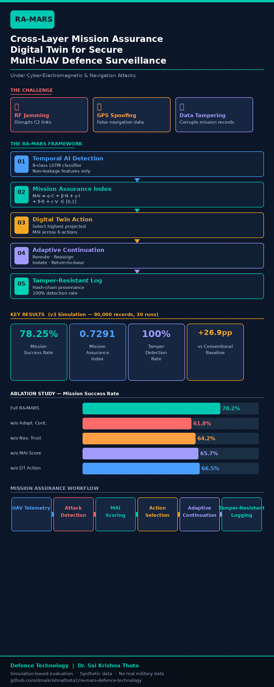

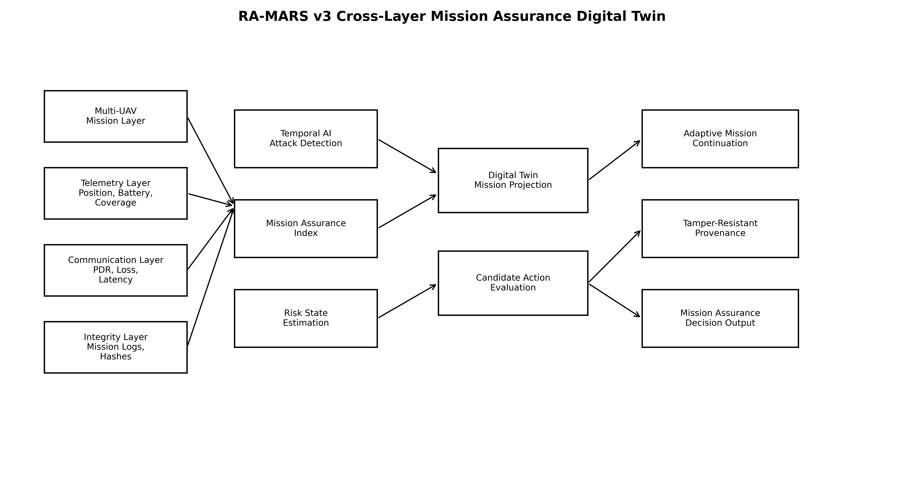

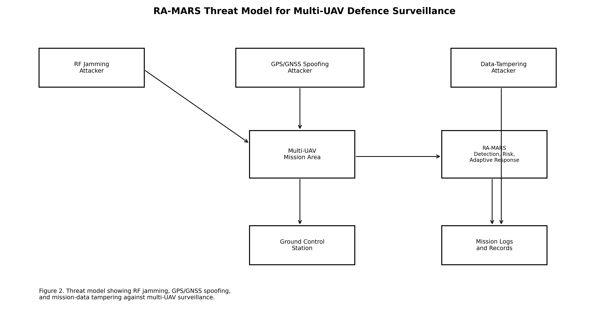

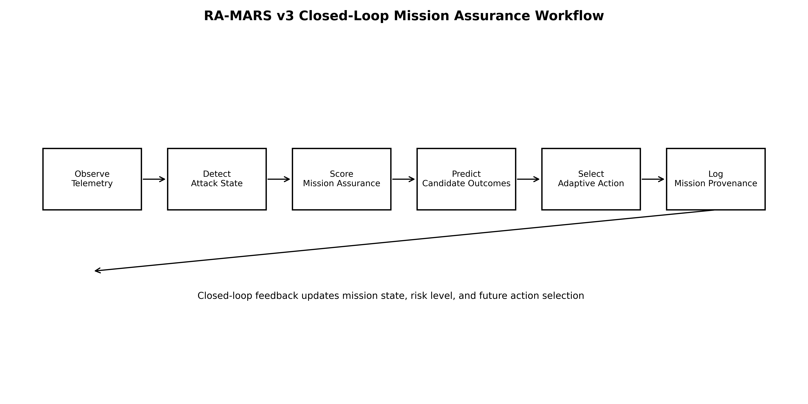

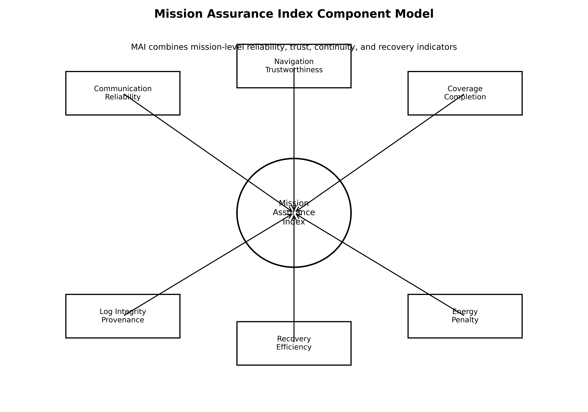

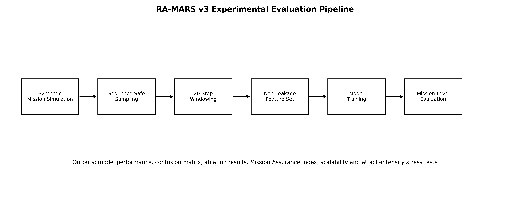

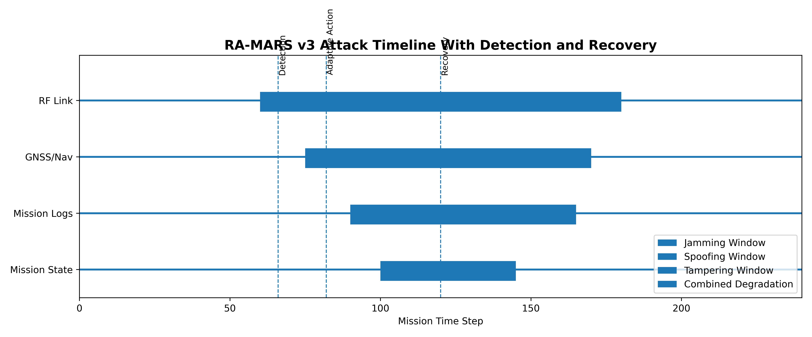

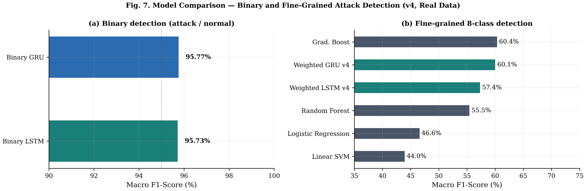

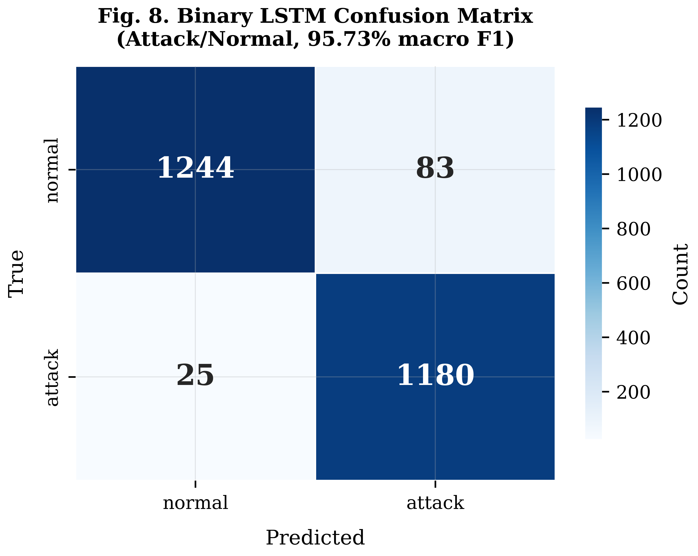

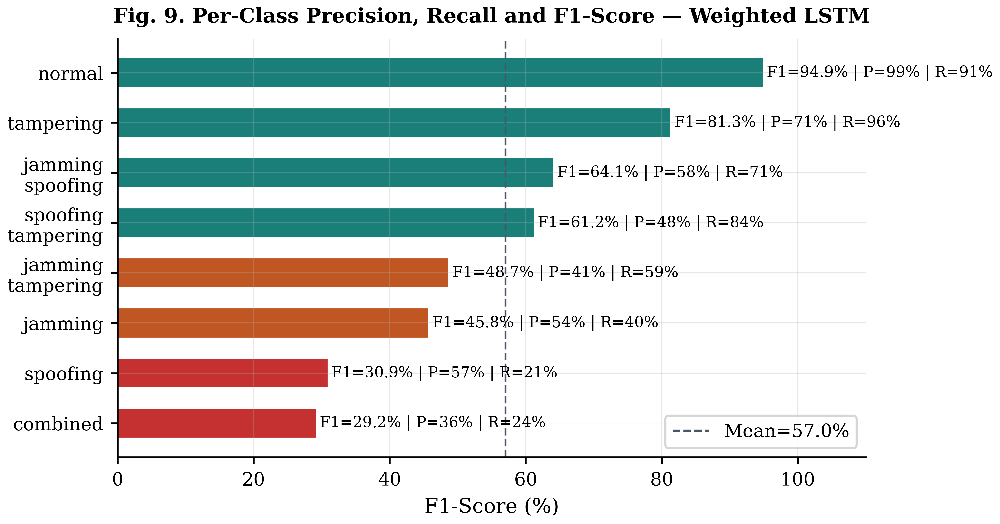

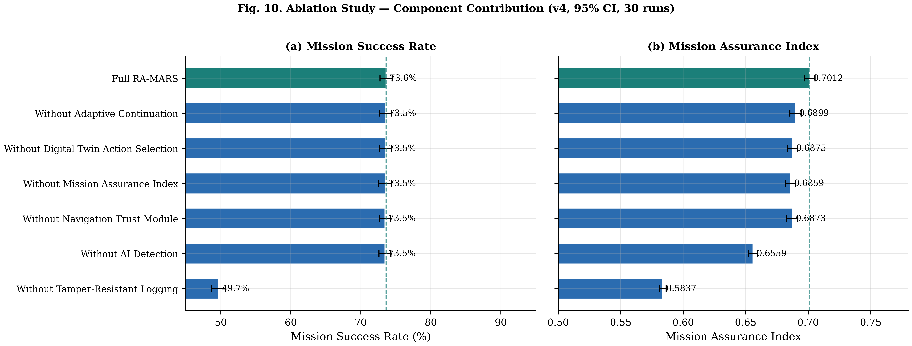

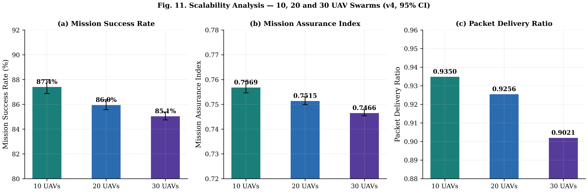

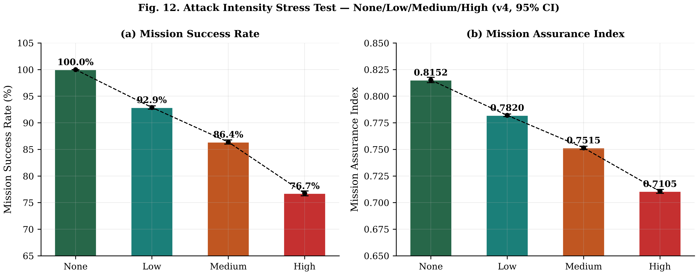

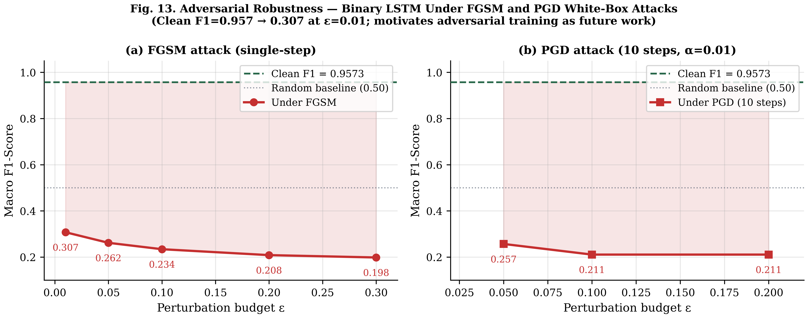

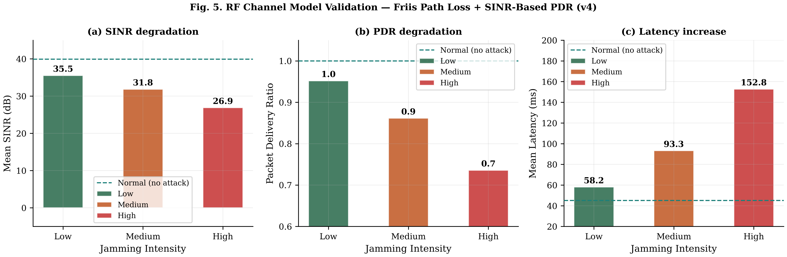

## Supplementary Figures

The following supplementary figures accompany the PX4-style MAVLink telemetry validation case study described in Section 6.4.

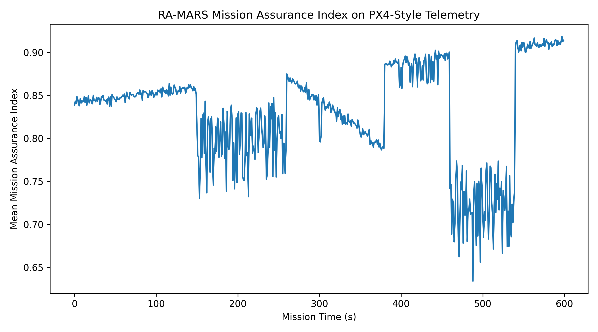

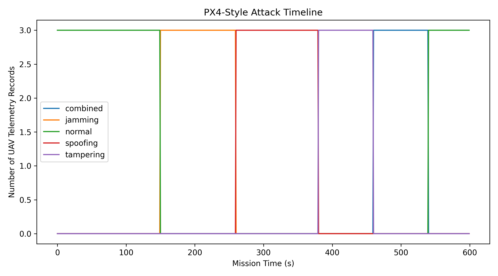

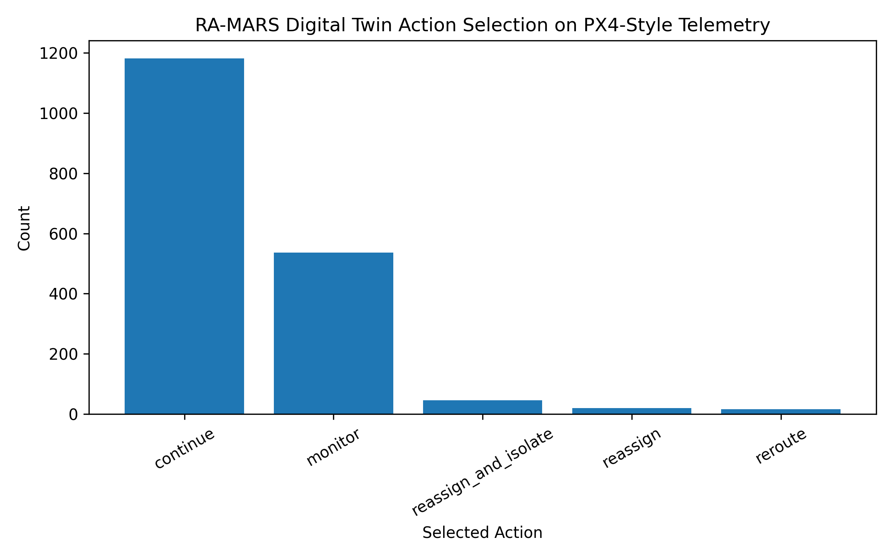

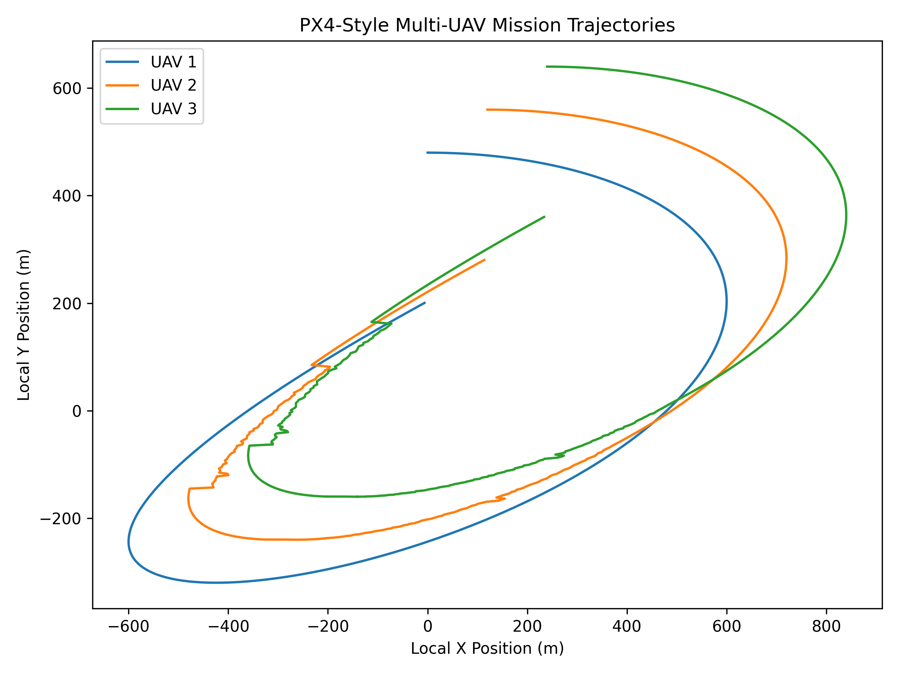

# Funding

This research did not receive any specific grant from funding agencies in the public, commercial, or not-for-profit sectors.

# Declaration of Generative AI and AI-Assisted Technologies in the Writing Process

During the preparation of this work the author used AI-assisted writing tools in order to improve language clarity and readability. After using these tools, the author reviewed and edited all content as needed and takes full responsibility for the content of the published article.

## References

[1] P. Stodola, J. Nohel, and L. Horák, “Dynamic reconnaissance operations with UAV swarms: adapting to environmental changes,” Sci. Rep., vol. 15, article 15092, 2025, doi: 10.1038/s41598-025-00201-4.

[2] S. Bi, K. Li, S. Hu, W. Ni, C. Wang, and X. Wang, “Detection and Mitigation of Position Spoofing Attacks on Cooperative UAV Swarm Formations,” IEEE Trans. Inf. Forensics Secur., vol. 19, pp. 1883–1895, 2024, doi: 10.1109/TIFS.2023.3341398.

[3] P. Mykytyn, M. Brzozowski, Z. Dyka, and P. Langendoerfer, “GPS-Spoofing Attack Detection Mechanism for UAV Swarms,” in 2023 12th Mediterranean Conference on Embedded Computing (MECO), 2023, doi: 10.1109/MECO58584.2023.10154998.

[4] L. Alhoraibi, D. Alghazzawi, and R. Alhebshi, “Detection of GPS Spoofing Attacks in UAVs Based on Adversarial Machine Learning Model,” Sensors, vol. 24, no. 18, article 6156, 2024, doi: 10.3390/s24186156.

[5] G. Wang, X. Lv, and X. Yan, “A Two-Stage Distributed Task Assignment Algorithm Based on Contract Net Protocol for Multi-UAV Cooperative Reconnaissance Task Reassignment in Dynamic Environments,” Sensors, vol. 23, no. 18, article 7980, 2023, doi: 10.3390/s23187980.

[6] Z. Lv, L. Xiao, Y. Du, G. Niu, C. Xing, and W. Xu, “Multi-Agent Reinforcement Learning Based UAV Swarm Communications Against Jamming,” IEEE Trans. Wirel. Commun., vol. 22, no. 12, pp. 9063–9075, 2023, doi: 10.1109/TWC.2023.3268082.

[7] J. Ghelani, P. Gharia, and H. El-Ocla, “Gradient Monitored Reinforcement Learning for Jamming Attack Detection in FANETs,” IEEE Access, vol. 12, pp. 23081–23095, 2024, doi: 10.1109/ACCESS.2024.3361945.

[8] Z. Lv, L. Xiao, Y. Chen, H. Chen, and X. Ji, “Safe Multi-Agent Reinforcement Learning for Wireless Applications Against Adversarial Communications,” IEEE Trans. Inf. Forensics Secur., vol. 19, pp. 6824–6839, 2024, doi: 10.1109/TIFS.2024.3423428.

[9] C. Greco, P. Pace, S. Basagni, and G. Fortino, “Jamming Detection at the Edge of Drone Networks Using Multi-layer Perceptrons and Decision Trees,” Appl. Soft Comput., vol. 111, article 107806, 2021, doi: 10.1016/j.asoc.2021.107806.

[10] Z. Shao, H. Yang, L. Xiao, W. Su, Y. Chen, and Z. Xiong, “Deep Reinforcement Learning-Based Resource Management for UAV-Assisted Mobile Edge Computing Against Jamming,” IEEE Trans. Mob. Comput., vol. 23, no. 12, pp. 13358–13374, 2024, doi: 10.1109/TMC.2024.3432491.

[11] Z. Yu, Z. Wang, J. Yu, D. Liu, H. H. Song, and Z. Li, “Cybersecurity of Unmanned Aerial Vehicles: A Survey,” IEEE Aerosp. Electron. Syst. Mag., vol. 39, no. 9, pp. 182–215, 2024, doi: 10.1109/MAES.2023.3318226.

[12] Y. Mekdad, A. Aris, L. Babun, A. El Fergougui, M. Conti, R. Lazzeretti, et al., “A Survey on Security and Privacy Issues of UAVs,” Comput. Netw., vol. 224, article 109626, 2023, doi: 10.1016/j.comnet.2023.109626.

[13] Z. Wang, K. Han, Y. Yang, and W. Tian, “A Survey on Cybersecurity Attacks and Defenses for Unmanned Aerial Systems,” J. Syst. Archit., vol. 138, article 102870, 2023, doi: 10.1016/j.sysarc.2023.102870.

[14] N. Bai, S. Wang, T. Zhang, N. N. Xiong, and S. Li, “A Survey on Unmanned Aerial Systems Cybersecurity,” J. Syst. Archit., vol. 156, article 103282, 2024, doi: 10.1016/j.sysarc.2024.103282.

[15] R. Sarenche, F. Aghili, T. Yoshizawa, and D. Singelée, “DASLog: Decentralized Auditable Secure Logging for UAV Ecosystems,” IEEE Internet Things J., vol. 10, no. 23, pp. 20264–20284, 2023, doi: 10.1109/JIOT.2023.3281263.

[16] R. Karmakar, G. Kaddoum, and O. Akhrif, “A Blockchain-Based Distributed and Intelligent Clustering-Enabled Authentication Protocol for UAV Swarms,” IEEE Trans. Mob. Comput., vol. 23, no. 5, pp. 6178–6195, 2024, doi: 10.1109/TMC.2023.3319544.

[17] R. Xiong, Q. Xiao, Z. Wang, Z. Xu, and F. Shan, “Leveraging Lightweight Blockchain for Secure Collaborative Computing in UAV Ad-Hoc Networks,” Comput. Netw., vol. 251, article 110612, 2024, doi: 10.1016/j.comnet.2024.110612.

[18] X. Tang, X. Lan, L. Li, Y. Zhang, and Z. Han, “Incentivizing Proof-of-Stake Blockchain for Secured Data Collection in UAV-Assisted IoT: A Multi-Agent Reinforcement Learning Approach,” IEEE J. Sel. Areas Commun., vol. 40, no. 12, pp. 3470–3484, 2022, doi: 10.1109/JSAC.2022.3213360.

[19] S. Hafeez, A. R. Khan, M. Al-Quraan, L. Mohjazi, A. Zoha, M. A. Imran, et al., “Blockchain-Assisted UAV Communication Systems: A Comprehensive Survey,” IEEE Open J. Veh. Technol., vol. 4, pp. 558–580, 2023, doi: 10.1109/OJVT.2023.3295208.

[20] L. Liu and J. Yang, “A Dynamic Mission Abort Policy for the Swarm Executing Missions and Its Solution Method by Tailored Deep Reinforcement Learning,” Reliab. Eng. Syst. Saf., vol. 234, article 109149, 2023, doi: 10.1016/j.ress.2023.109149.

[21] X. Zhou, Y. Huang, G. Bai, B. Xu, and J. Tao, “The Resilience Evaluation of Unmanned Autonomous Swarm with Informed Agents under Partial Failure,” Reliab. Eng. Syst. Saf., vol. 244, article 109920, 2024, doi: 10.1016/j.ress.2023.109920.

[22] T. Liu, G. Bai, J. Tao, Y.-A. Zhang, and Y. Fang, “A Multistate Network Approach for Resilience Analysis of UAV Swarm Considering Information Exchange Capacity,” Reliab. Eng. Syst. Saf., vol. 241, article 109606, 2024, doi: 10.1016/j.ress.2023.109606.

[23] Q. Sun, H. Li, Y. Zhong, K. Ren, and Y. Zhang, “Deep Reinforcement Learning-Based Resilience Enhancement Strategy of Unmanned Weapon System-of-Systems under Inevitable Interferences,” Reliab. Eng. Syst. Saf., vol. 242, article 109749, 2024, doi: 10.1016/j.ress.2023.109749.

[24] C. Zhang, T. Liu, G. Bai, J. Tao, and W. Zhu, “A Dynamic Resilience Evaluation Method for Cross-Domain Swarms in Confrontation,” Reliab. Eng. Syst. Saf., vol. 244, article 109904, 2024, doi: 10.1016/j.ress.2023.109904.

[25] S. C. Hassler, U. A. Mughal, and M. Ismail, “Cyber-Physical Intrusion Detection System for Unmanned Aerial Vehicles,” IEEE Trans. Intell. Transp. Syst., vol. 25, no. 6, pp. 6106–6117, 2024, doi: 10.1109/TITS.2023.3339728.

[26] H. J. Hadi, Y. Cao, S. Li, Y. Hu, J. Wang, and S. Wang, “Real-Time Collaborative Intrusion Detection System in UAV Networks Using Deep Learning,” IEEE Internet Things J., vol. 11, no. 20, pp. 33371–33391, 2024, doi: 10.1109/JIOT.2024.3426511.

[27] R. A. AL-Syouf, R. M. Bani-Hani, and O. Y. AL-Jarrah, “Machine Learning Approaches to Intrusion Detection in Unmanned Aerial Vehicles (UAVs),” Neural Comput. Appl., vol. 36, no. 29, pp. 18009–18041, 2024, doi: 10.1007/s00521-024-10306-y.

[28] J. Medhi, R. Liu, Q. Wang, and X. Chen, “A Lightweight and Efficient Intrusion Detection System (IDS) for Unmanned Aerial Vehicles,” Neural Comput. Appl., vol. 37, no. 20, pp. 15819–15836, 2025, doi: 10.1007/s00521-025-11276-5.

[29] Y. Luo, Y. Xiao, L. Cheng, G. Peng, and D. Yao, “Deep Learning-Based Anomaly Detection in Cyber-Physical Systems: Progress and Opportunities,” ACM Comput. Surv., vol. 54, no. 5, article 106, 2021, doi: 10.1145/3453155.

[30] L. Xiang, F. Wang, W. Xu, T. Zhang, M. Pan, and Z. Han, “Dynamic UAV Swarm Collaboration for Multi-Targets Tracking Under Malicious Jamming: Joint Power, Path and Target Association Optimization,” IEEE Trans. Veh. Technol., vol. 73, no. 4, pp. 5410–5425, 2024, doi: 10.1109/TVT.2023.3333054.

[31] Z. Yin, J. Li, Z. Wang, Y. Qian, Y. Lin, F. Shu, and W. Chen, “UAV Communication Against Intelligent Jamming: A Stackelberg Game Approach With Federated Reinforcement Learning,” IEEE Trans. Green Commun. Netw., vol. 8, no. 4, pp. 1796–1808, 2024, doi: 10.1109/TGCN.2024.3373886.

[32] Y. Su, N. Qi, Z. Huang, R. Yao, and L. Jia, “Cooperative Anti-Jamming and Interference Mitigation for UAV Networks: A Local Altruistic Game Approach,” China Commun., vol. 21, no. 2, pp. 183–196, 2024, doi: 10.23919/JCC.fa.2021-0759.202402.

[33] C. Fang, Y. Feng, X. Li, and Y. Yang, “Multi-UAV Energy-Efficient Detection Coverage Under Jamming Environment: A Hierarchical Collaborative Learning Approach,” IEEE Trans. Veh. Technol., vol. 74, pp. 7351–7363, 2025, doi: 10.1109/TVT.2025.3529036.

[34] X. Ma, M. Gao, Y. Zhao, and M. Yu, “A Novel Navigation Spoofing Algorithm for UAV Based on GPS/INS-Integrated Navigation,” IEEE Trans. Veh. Technol., vol. 73, no. 10, pp. 15424–15439, 2024, doi: 10.1109/TVT.2024.3401856.

[35] S. A. Negru, P. Geragersian, I. Petrunin, and W. Guo, “Resilient Multi-Sensor UAV Navigation with a Hybrid Federated Fusion Architecture,” Sensors, vol. 24, no. 3, article 981, 2024, doi: 10.3390/s24030981.

[36] I. Jarraya, A. Al-Batati, M. B. Kadri, M. Abdelkader, A. Ammar, W. Boulila, et al., “GNSS-Denied Unmanned Aerial Vehicle Navigation: Analyzing Computational Complexity, Sensor Fusion, and Localization Methodologies,” Satell. Navig., vol. 6, article 9, 2025, doi: 10.1186/s43020-025-00162-z.

[37] C. Meng, Q. Hu, S. S. Ge, and D. Li, “Trusted Multisource Fusion Navigation for UAV Under GNSS Interference and Spoofing Attacks,” IEEE/ASME Trans. Mechatron., vol. 30, no. 6, pp. 4165–4175, 2025, doi: 10.1109/TMECH.2025.3570315.

[38] Y. Zeng, Z. Lu, X. Zhao, Z. Xiao, S. Ni, Z. Han, et al., “GNSS Jamming and Spoofing Threats in UAV Navigation: Countermeasure Status and Challenges,” IEEE Commun. Surv. Tutor., vol. 28, pp. 5909–5948, 2025, doi: 10.1109/COMST.2026.3680438.

[39] B. Zhao, M. Huo, Z. Li, W. Feng, Z. Yu, N. Qi, and S. Wang, “Graph-Based Multi-Agent Reinforcement Learning for Collaborative Search and Tracking of Multiple UAVs,” Chin. J. Aeronaut., vol. 38, no. 3, article 103214, 2025, doi: 10.1016/j.cja.2024.08.045.

[40] Z. Zhang, J. Jiang, H. Xu, and W.-A. Zhang, “Distributed Dynamic Task Allocation for Unmanned Aerial Vehicle Swarm Systems: A Networked Evolutionary Game-Theoretic Approach,” Chin. J. Aeronaut., vol. 37, no. 6, pp. 182–204, 2024, doi: 10.1016/j.cja.2023.12.027.

[41] D. Liu, L. Dou, R. Zhang, X. Zhang, and Q. Zong, “Multi-Agent Reinforcement Learning-Based Coordinated Dynamic Task Allocation for Heterogeneous UAVs,” IEEE Trans. Veh. Technol., vol. 72, no. 4, pp. 4372–4383, 2023, doi: 10.1109/TVT.2022.3228198.

[42] K. Li, J. Liu, X. Gu, Y. Yang, C. Chang, H. Chen, L. Wan, and Y. Lin, “Dynamic Decision-Making of UAV Swarm Based on Constrained Multi-Objective Optimization Under Incomplete Interference Information,” Chin. J. Aeronaut., article 103846, 2025, doi: 10.1016/j.cja.2025.103846.

[43] X. Wang, Z. Zhao, L. Yi, Z. Ning, L. Guo, F. R. Yu, and S. Guo, “A Survey on Security of UAV Swarm Networks: Attacks and Countermeasures,” ACM Comput. Surv., vol. 57, no. 3, article 74, pp. 1–37, 2024, doi: 10.1145/3703625.

[44] E. Glaessgen and D. Stargel, "The Digital Twin Paradigm for Future NASA and U.S. Air Force Vehicles," in Proc. 53rd AIAA/ASME/ASCE/AHS/ASC Struct., Struct. Dyn. Mater. Conf., 2012, doi: 10.2514/6.2012-1818.

[45] A. Rasheed, O. San, and T. Kvamsdal, "Digital Twin: Values, Challenges and Enablers From a Modeling Perspective," IEEE Access, vol. 8, pp. 21980–22012, 2020, doi: 10.1109/ACCESS.2020.2970143.

[46] M. Eckhart and A. Ekelhart, "A Specification-Based State Replication Approach for Digital Twins," in Proc. ACM Workshop Cyber-Phys. Syst. Secur. Privacy (CPSS), 2018, pp. 36–47, doi: 10.1145/3264888.3264892.

[47] D. Dolev and A. C. Yao, "On the Security of Public Key Protocols," IEEE Trans. Inf. Theory, vol. 29, no. 2, pp. 198–208, 1983, doi: 10.1109/TIT.1983.1056650., "A Specification-Based State Replication Approach for Digital Twins," in Proc. ACM Workshop Cyber-Phys. Syst. Secur. Privacy (CPSS), 2018, pp. 36–47, doi: 10.1145/3264888.3264892.

