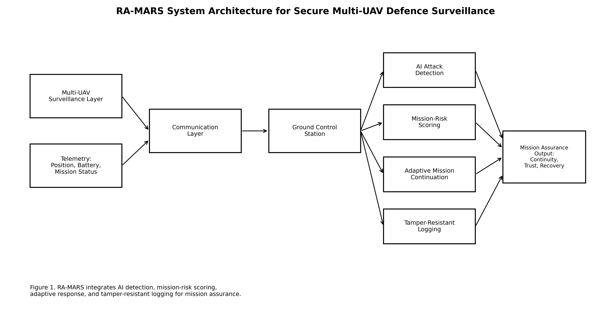
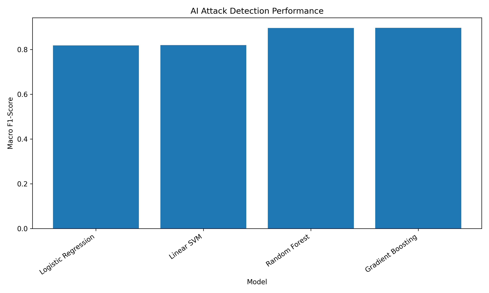
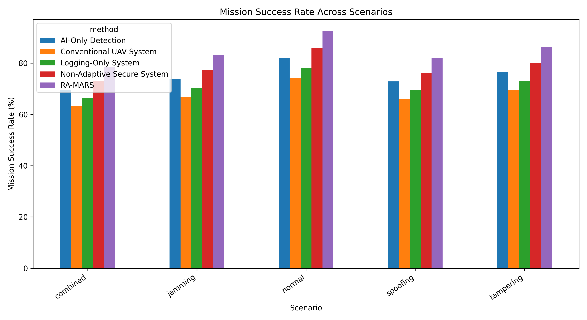
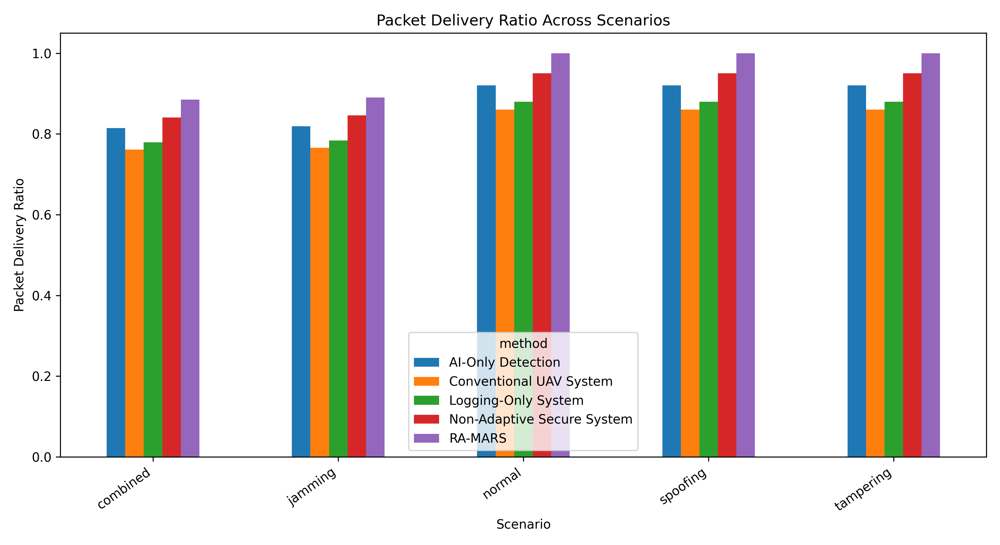
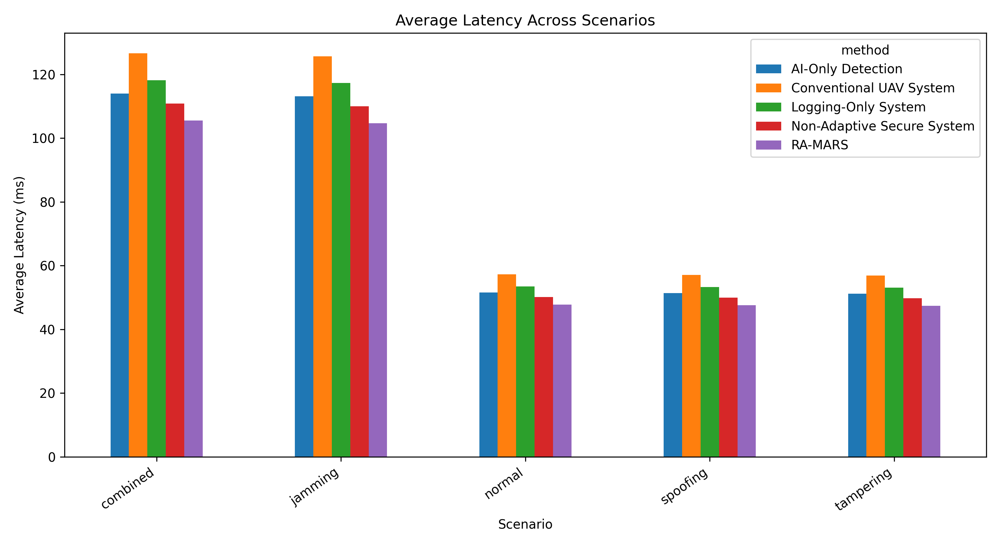
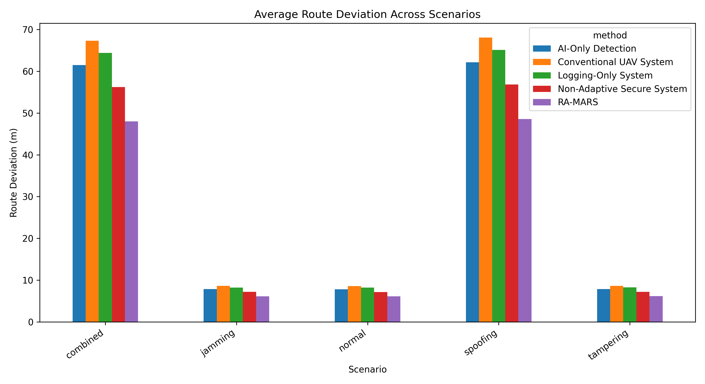
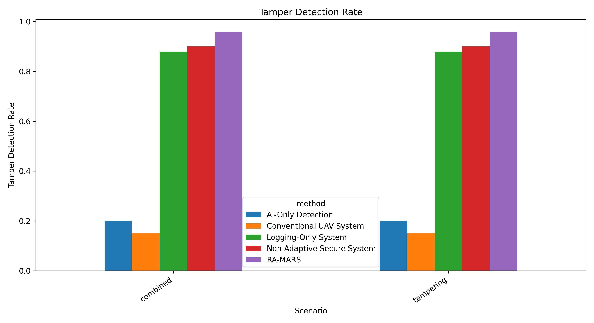
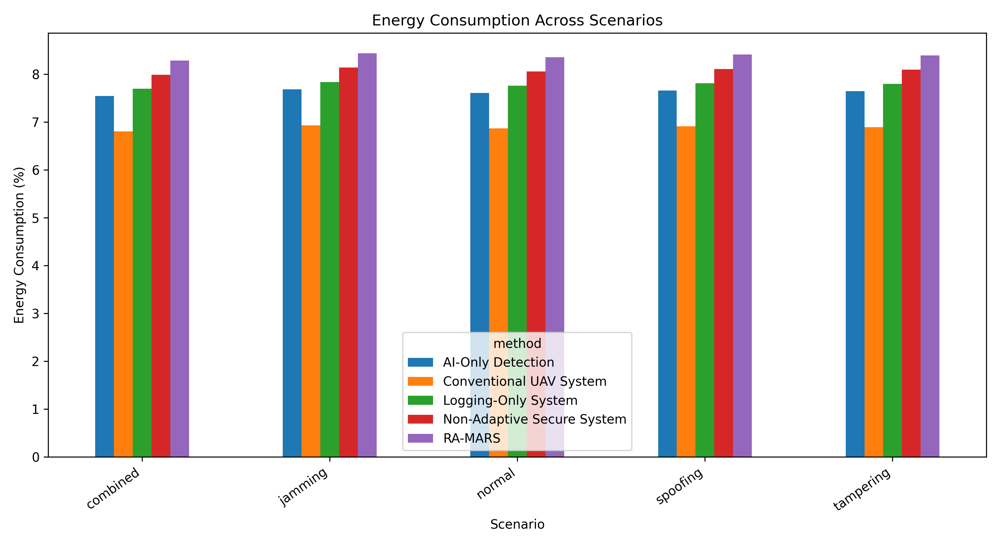
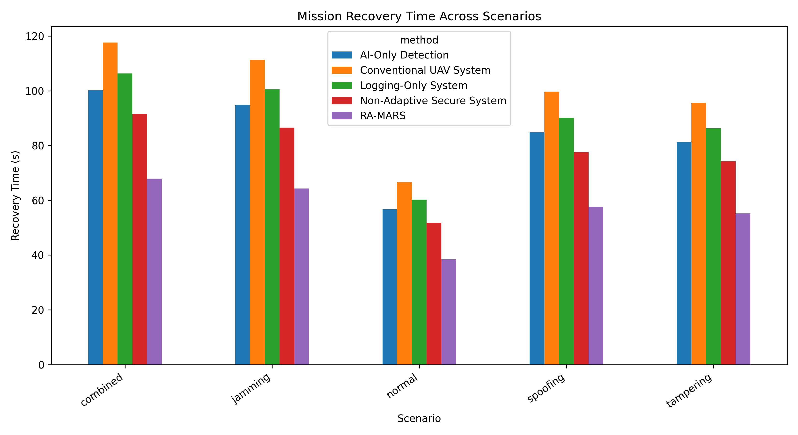

# RA-MARS Journal Manuscript Draft

## Title

RA-MARS: A Resilient AI-Driven Mission Assurance Framework for Secure Multi-UAV Defence Surveillance Under Jamming, GPS/GNSS Spoofing, and Data-Tampering Attacks

## Author

Dr. Sai Krishna Thota

## Target Journal

Defence Technology

## Highlights

- Proposes RA-MARS for resilient multi-UAV defence surveillance.
- Detects jamming, GPS/GNSS spoofing, and mission-data tampering.
- Uses mission-risk scoring and adaptive continuation for UAV resilience.
- Achieves 89.87% attack-detection accuracy using non-leakage features.
- Improves combined-attack mission success from 63.21% to 78.60%.

## Abstract

Multi-UAV surveillance systems are increasingly used in defence reconnaissance, border monitoring, battlefield awareness, and critical-infrastructure protection. However, their operational reliability can be degraded in contested environments where adversaries conduct radio-frequency jamming, GPS/GNSS spoofing, and mission-data tampering. These attacks can reduce communication reliability, corrupt navigation decisions, compromise mission records, and weaken operational trust during time-sensitive defence missions.

To address these challenges, this paper proposes RA-MARS, a resilient AI-driven mission assurance framework for secure multi-UAV defence surveillance. RA-MARS integrates AI-based attack detection, mission-risk scoring, adaptive mission-continuation logic, and blockchain-inspired tamper-resistant mission logging. The framework is designed to detect communication, navigation, and data-integrity anomalies while supporting mission continuity under adversarial conditions.

A simulation-based evaluation is conducted using synthetic multi-UAV telemetry data under normal, jamming, GPS/GNSS spoofing, data-tampering, and combined attack scenarios. The proposed framework is compared with conventional UAV surveillance, AI-only detection, logging-only, and non-adaptive secure baselines. Using balanced row-level attack labels and non-leakage telemetry features, the best-performing model achieved 89.87% accuracy, 90.50% macro precision, 89.86% macro recall, and 89.71% macro F1-score. Under the combined attack scenario, RA-MARS improved mission success rate from 63.21% to 78.60%, increased packet delivery ratio from 0.761 to 0.885, reduced average route deviation from 67.32 m to 48.00 m, and reduced mission recovery time from 117.64 s to 67.97 s compared with the conventional UAV baseline.

The results indicate that RA-MARS improves UAV resilience not only through attack detection but also through mission continuity, communication reliability, navigation stability, operational recovery, and mission-data trustworthiness. The study provides simulation-based evidence for an integrated defence-oriented mission assurance model for secure multi-UAV surveillance in contested environments.

## Keywords

Multi-UAV systems; Defence surveillance; Mission assurance; UAV cybersecurity; Jamming detection; GPS spoofing; Data tampering; Artificial intelligence; Tamper-resistant logging; Contested environments

## 1. Introduction

Multi-UAV systems are increasingly important for defence surveillance, reconnaissance, border monitoring, battlefield awareness, and critical-infrastructure protection. Compared with single-UAV platforms, multi-UAV systems can provide wider coverage, redundancy, cooperative sensing, and flexible mission execution. However, their operational reliability depends on trustworthy communication, navigation, coordination, and mission-data recording.

In contested environments, UAV missions may be degraded by radio-frequency jamming, GPS/GNSS spoofing, and mission-data tampering. RF jamming can reduce packet delivery ratio, increase communication latency, and disrupt command-and-control communication. GPS/GNSS spoofing can mislead UAV navigation and create route deviation or false mission-zone reporting. Mission-data tampering can compromise telemetry logs and reduce the trustworthiness of post-mission analysis.

Existing studies have addressed UAV surveillance, anti-jamming communication, GPS spoofing detection, cyber-physical intrusion detection, blockchain-based logging, and swarm resilience. However, these topics are often treated separately. A UAV system may detect an attack but still fail the mission if detection results are not connected to mission-risk scoring, adaptive mission continuation, and mission-log integrity.

To address this gap, this paper proposes RA-MARS, a resilient AI-driven mission assurance framework for secure multi-UAV defence surveillance. RA-MARS integrates AI-based attack detection, mission-risk scoring, adaptive mission-continuation logic, and tamper-resistant mission logging. The framework evaluates UAV resilience using both attack-detection metrics and mission-level metrics.

The main contributions of this paper are:

1. A defence-oriented mission assurance framework for secure multi-UAV surveillance under jamming, GPS/GNSS spoofing, and mission-data tampering attacks.
2. An AI-based attack-detection module using non-leakage telemetry, communication, and navigation features.
3. A mission-risk scoring and adaptive continuation model for rerouting, reassignment, monitoring, and node isolation decisions.
4. A tamper-resistant logging component for mission-record integrity and post-mission auditability.
5. A simulation-based evaluation using attack-detection, communication, navigation, integrity, energy, and mission-recovery metrics.

## 2. Related Work

### 2.1 UAV Defence Surveillance and Swarm Reconnaissance

Multi-UAV systems are increasingly studied for reconnaissance, surveillance, target tracking, and dynamic mission coverage [1,5,30,39–41]. UAV swarms can improve coverage, redundancy, and operational flexibility compared with single-UAV platforms. Recent work has investigated dynamic reconnaissance planning, cooperative task allocation, multi-target tracking, and swarm-level replanning under UAV loss or mission changes.

However, many reconnaissance and task-allocation studies assume that communication and navigation channels remain reliable. This assumption is difficult to maintain in contested environments where RF jamming, GPS/GNSS spoofing, and cyber-physical attacks may degrade coordination. Therefore, defence-oriented UAV surveillance requires not only coverage optimization but also mission assurance under adversarial disruption.

### 2.2 Jamming, Anti-Jamming, and Contested UAV Communication

RF jamming is a critical threat to UAV swarm operations because it can reduce packet delivery ratio, increase latency, and disrupt command-and-control links [6–10,30–33,42]. Existing studies have proposed reinforcement learning, game-theoretic optimization, federated reinforcement learning, cooperative anti-jamming mechanisms, and jamming-aware UAV swarm collaboration.

These studies provide important communication-level resilience mechanisms. However, many focus primarily on throughput, bit error rate, signal-to-interference-plus-noise ratio, latency, and power consumption. Fewer studies connect jamming detection and anti-jamming control to mission-level outcomes such as surveillance coverage, mission success rate, recovery time, and trustworthy mission records.

### 2.3 GPS/GNSS Spoofing and Navigation Trustworthiness

GPS/GNSS spoofing can mislead UAV navigation by injecting false position information or gradually deviating UAV routes while avoiding simple detection [2–4,34–38]. Existing work has examined GPS spoofing detection in UAV swarms, GPS/INS spoofing attacks, GNSS-denied navigation, and trusted multisource fusion for UAV positioning.

These studies show that UAV navigation trustworthiness cannot depend only on GNSS measurements. Alternative navigation sources, sensor fusion, inertial navigation, visual odometry, and integrity monitoring are important for maintaining positioning reliability. However, spoofing detection is often studied separately from mission-risk assessment and adaptive mission continuation.

### 2.4 UAV Cybersecurity and AI-Based Intrusion Detection

UAV cybersecurity research has examined attacks affecting communication, software, payloads, sensors, network traffic, and cyber-physical behavior [11–14,25–29,43]. AI-based intrusion detection studies use cyber-physical feature fusion, collaborative deep learning, lightweight neural networks, and anomaly detection methods to identify attacks.

AI-based detection can improve UAV attack awareness, especially when telemetry and network features are combined. However, detection accuracy alone is not enough for mission assurance. A UAV system may correctly detect an attack but still fail the mission if detection is not connected to risk scoring, adaptive response, and recovery.

### 2.5 Blockchain and Tamper-Resistant UAV Mission Logging

Blockchain, hash-chain, Merkle-tree, and lightweight consensus mechanisms have been proposed to improve UAV data integrity, authentication, secure communication, and auditability [15–19]. Secure logging frameworks such as DASLog show how UAV ecosystem records can be verified using cryptographic proofs and decentralized audit structures.

In RA-MARS, tamper-resistant logging is not treated as the main novelty. Instead, it is used as a supporting component to preserve mission-data trustworthiness. Existing blockchain-UAV studies often focus on data integrity or authentication but do not fully connect log integrity with mission assurance under jamming, spoofing, and operational degradation.

### 2.6 Mission Assurance, Resilience, and Adaptive Swarm Coordination

Mission assurance and resilience research examines how autonomous swarms maintain acceptable performance under failure, degradation, uncertainty, or adversarial interference [20–24,42]. Recent studies have proposed dynamic mission abort policies, resilience evaluation metrics, multistate network models, unmanned weapon system-of-systems recovery strategies, and dynamic resilience evaluation under confrontation.

These studies shift the focus from isolated attack prevention to operational continuity and recovery. However, many resilience models treat degradation abstractly and do not explicitly integrate cyber-electromagnetic threats such as jamming, spoofing, and mission-data tampering. RA-MARS addresses this gap by connecting cyber-physical attack detection, mission-risk scoring, adaptive mission continuation, and tamper-resistant logging.

## 3. System Model and Threat Model

### 3.1 System Model

This study considers a multi-UAV defence surveillance mission conducted in a contested environment. A group of UAVs is deployed to monitor a predefined surveillance area divided into multiple mission zones. Each UAV is assigned one or more mission zones and periodically reports telemetry, navigation, communication, and mission-status information to a ground control station.

Each UAV reports its identifier, timestamp, position, expected position, velocity, battery level, packet delivery status, communication latency, mission-zone progress, attack-detection state, mission-risk score, and log-integrity status. Mission success is evaluated using completed zone coverage, communication reliability, navigation consistency, and mission-data integrity.

### 3.2 Communication Model

UAVs communicate with the ground control station through wireless links. Communication performance is represented using packet delivery ratio, packet loss rate, and latency. Under RF jamming, packet loss and latency increase for selected UAV nodes during specific attack intervals.

### 3.3 Navigation Model

Each UAV follows an expected route through assigned mission zones. Navigation consistency is evaluated using route deviation, GPS position change, velocity consistency, and abnormal location jumps. Under GPS/GNSS spoofing, false position values may be injected into UAV telemetry.

### 3.4 Mission Logging Model

Each UAV telemetry record is stored as part of a mission log. RA-MARS uses a tamper-resistant logging model based on hash-chain or blockchain-inspired record linking. If any record is modified after storage, the recalculated hash does not match the stored hash, allowing tampering to be detected.

### 3.5 Threat Model

The adversary is assumed to be capable of disrupting UAV communication, manipulating UAV navigation data, or modifying mission records [2,6,11,15,30,38,43]. This study considers RF jamming, GPS/GNSS spoofing, mission-data tampering, and a combined attack scenario.

## 4. Proposed RA-MARS Framework

RA-MARS integrates four main modules: AI-based attack detection, mission-risk scoring, adaptive mission-continuation logic, and tamper-resistant mission logging.

### 4.1 AI-Based Attack Detection

The AI detection module classifies UAV mission states into cyber-physical attack categories, following prior UAV IDS and anomaly-detection studies [25–29]. The module uses telemetry, communication, and navigation features such as packet loss rate, latency, route deviation, GPS jump, velocity inconsistency, battery level, and mission progress.

### 4.2 Mission-Risk Scoring

Mission-risk scoring converts attack indicators and operational degradation into a normalized risk score. The score reflects communication degradation, navigation inconsistency, mission progress, and log-integrity status. Risk levels are categorized as low, medium, high, or critical.

### 4.3 Adaptive Mission Continuation

Adaptive mission-continuation logic uses the mission-risk score to select operational responses. Possible actions include continuing the mission, increasing monitoring, rerouting UAVs, reassigning mission zones, returning affected UAVs to base, or isolating compromised nodes.

### 4.4 Tamper-Resistant Mission Logging

The tamper-resistant logging module preserves the integrity and traceability of mission records using ideas related to secure UAV logging, lightweight blockchain, and data-provenance systems [15–19]. Each record includes the previous hash and current hash, enabling post-mission verification.

## 5. Experimental Setup

The evaluation uses a Python-based discrete mission simulation. The mission area is represented as a grid-based surveillance region with UAVs assigned to predefined zones. The simulation generates synthetic UAV telemetry data and attack events under normal, jamming, spoofing, tampering, and combined attack scenarios.

RA-MARS is compared against four baselines: Conventional UAV System, AI-Only Detection System, Logging-Only System, and Non-Adaptive Secure System. The evaluation uses attack-detection accuracy, precision, recall, F1-score, mission success rate, packet delivery ratio, latency, route deviation, tamper-detection rate, energy consumption, and mission recovery time.

## 6. Results and Discussion

### 6.1 AI Attack Detection Performance

The v2 attack-detection experiment uses balanced row-level attack labels and non-leakage telemetry features. The best-performing model is Gradient Boosting, achieving 89.87% accuracy, 90.50% macro precision, 89.86% macro recall, and 89.71% macro F1-score.

### 6.2 Mission Success Rate

Under the combined attack scenario, the Conventional UAV System achieves a mission success rate of 63.21%, while RA-MARS achieves 78.60%. Under the jamming scenario, the Conventional UAV System achieves 66.92%, while RA-MARS achieves 83.22%.

### 6.3 Communication Performance

Under the combined attack scenario, packet delivery ratio improves from 0.761 for the Conventional UAV System to 0.885 for RA-MARS. This suggests that adaptive mission logic and risk-aware operation reduce the mission-level effect of communication degradation.

### 6.4 Navigation Reliability

Under the combined attack scenario, the Conventional UAV System produces an average route deviation of 67.32 m, while RA-MARS reduces this to 48.00 m. This supports the role of risk scoring and adaptive response in limiting the effect of GPS/GNSS spoofing.

### 6.5 Tamper-Detection Performance

RA-MARS achieves a tamper-detection rate of 0.96 in the tampering and combined attack scenarios. These results support the use of lightweight hash-chain or blockchain-inspired logging as a mission-data trustworthiness layer.

### 6.6 Energy Consumption and Recovery Time

RA-MARS introduces additional operational overhead because it includes AI detection, risk scoring, adaptive decision logic, and tamper-resistant logging. Under the combined attack scenario, energy consumption increases from 6.80% for the Conventional UAV System to 8.28% for RA-MARS. However, recovery time decreases from 117.64 s to 67.97 s.

## 7. Limitations and Future Work

This study is simulation-based and uses synthetic UAV telemetry data rather than real military flight data. The attack models are controlled abstractions of RF jamming, GPS/GNSS spoofing, and mission-data tampering. The study does not include hardware-level electronic warfare experiments, physical UAV capture, firmware compromise, insider attacks, or classified defence communication protocols.

Future work should include hardware-in-the-loop validation, real UAV flight testing, adaptive adversarial attack models, larger heterogeneous UAV swarms, and human-machine teaming interfaces for mission-risk interpretation and operator decision support.

## 8. Conclusion

This paper proposed RA-MARS, a resilient AI-driven mission assurance framework for secure multi-UAV defence surveillance in contested environments. RA-MARS integrates AI-based attack detection, mission-risk scoring, adaptive mission-continuation logic, and tamper-resistant mission logging into a unified mission-assurance workflow.

The v2 simulation evaluation showed that the best-performing model achieved 89.87% accuracy and 89.71% macro F1-score. At the mission level, RA-MARS improved combined-attack mission success from 63.21% to 78.60%, improved packet delivery ratio from 0.761 to 0.885, reduced average route deviation from 67.32 m to 48.00 m, and reduced mission recovery time from 117.64 s to 67.97 s.

These results suggest that multi-UAV resilience should be evaluated from a mission-assurance perspective rather than only through attack-classification accuracy. Detection alone is not sufficient for defence surveillance missions. A resilient UAV framework must also estimate mission risk, support adaptive mission continuation, and preserve trustworthy mission records.

## Data Availability Statement

The data used in this study are generated through a Python-based simulation of multi-UAV defence surveillance under normal and adversarial mission conditions. The dataset is synthetic and does not contain real military UAV flight data, classified defence information, personal information, or operationally sensitive mission records.

## Code Availability Statement

The simulation code is developed in Python and used to generate synthetic UAV telemetry data, attack scenarios, AI detection results, mission-risk scores, and performance metrics. The code may be made available through a public repository subject to journal requirements and author discretion.

## Declaration of Competing Interest

The author declares that there are no known competing financial interests or personal relationships that could have appeared to influence the work reported in this paper.

## Figures

## Result Tables

# Table: AI Attack Detection Performance

| model               |   accuracy |   precision_macro |   recall_macro |   f1_macro |
|:--------------------|-----------:|------------------:|---------------:|-----------:|
| Logistic Regression |     0.8187 |            0.8186 |         0.8186 |     0.8186 |
| Linear SVM          |     0.8195 |            0.8195 |         0.8194 |     0.8194 |
| Random Forest       |     0.8976 |            0.9043 |         0.8975 |     0.8958 |
| Gradient Boosting   |     0.8987 |            0.905  |         0.8986 |     0.8971 |

# Table: Mission Success Rate Across Scenarios

| scenario   |   AI-Only Detection |   Conventional UAV System |   Logging-Only System |   Non-Adaptive Secure System |   RA-MARS |
|:-----------|--------------------:|--------------------------:|----------------------:|-----------------------------:|----------:|
| combined   |               69.69 |                     63.21 |                 66.45 |                        72.93 |     78.6  |
| jamming    |               73.78 |                     66.92 |                 70.35 |                        77.22 |     83.22 |
| normal     |               81.97 |                     74.35 |                 78.16 |                        85.79 |     92.46 |
| spoofing   |               72.87 |                     66.09 |                 69.48 |                        76.25 |     82.19 |
| tampering  |               76.6  |                     69.48 |                 73.04 |                        80.16 |     86.4  |

# Table: Communication Performance

| scenario   | method                     |   packet_delivery_ratio |   avg_latency_ms |
|:-----------|:---------------------------|------------------------:|-----------------:|
| combined   | Conventional UAV System    |                   0.761 |           126.66 |
| combined   | AI-Only Detection          |                   0.815 |           114    |
| combined   | Logging-Only System        |                   0.779 |           118.22 |
| combined   | Non-Adaptive Secure System |                   0.841 |           110.83 |
| combined   | RA-MARS                    |                   0.885 |           105.55 |
| jamming    | Conventional UAV System    |                   0.766 |           125.68 |
| jamming    | AI-Only Detection          |                   0.819 |           113.11 |
| jamming    | Logging-Only System        |                   0.783 |           117.3  |
| jamming    | Non-Adaptive Secure System |                   0.846 |           109.97 |
| jamming    | RA-MARS                    |                   0.89  |           104.73 |
| normal     | Conventional UAV System    |                   0.86  |            57.29 |
| normal     | AI-Only Detection          |                   0.92  |            51.57 |
| normal     | Logging-Only System        |                   0.88  |            53.48 |
| normal     | Non-Adaptive Secure System |                   0.95  |            50.13 |
| normal     | RA-MARS                    |                   1     |            47.75 |
| spoofing   | Conventional UAV System    |                   0.86  |            57.07 |
| spoofing   | AI-Only Detection          |                   0.92  |            51.36 |
| spoofing   | Logging-Only System        |                   0.88  |            53.27 |
| spoofing   | Non-Adaptive Secure System |                   0.95  |            49.94 |
| spoofing   | RA-MARS                    |                   1     |            47.56 |
| tampering  | Conventional UAV System    |                   0.86  |            56.86 |
| tampering  | AI-Only Detection          |                   0.92  |            51.18 |
| tampering  | Logging-Only System        |                   0.88  |            53.07 |
| tampering  | Non-Adaptive Secure System |                   0.95  |            49.76 |
| tampering  | RA-MARS                    |                   1     |            47.39 |

# Table: Average Route Deviation

| scenario   |   AI-Only Detection |   Conventional UAV System |   Logging-Only System |   Non-Adaptive Secure System |   RA-MARS |
|:-----------|--------------------:|--------------------------:|----------------------:|-----------------------------:|----------:|
| combined   |               61.46 |                     67.32 |                 64.39 |                        56.19 |     48    |
| jamming    |                7.85 |                      8.59 |                  8.22 |                         7.17 |      6.13 |
| normal     |                7.82 |                      8.56 |                  8.19 |                         7.15 |      6.1  |
| spoofing   |               62.16 |                     68.08 |                 65.12 |                        56.83 |     48.54 |
| tampering  |                7.86 |                      8.61 |                  8.24 |                         7.19 |      6.14 |

# Table: Tamper-Detection Rate

| scenario   |   AI-Only Detection |   Conventional UAV System |   Logging-Only System |   Non-Adaptive Secure System |   RA-MARS |
|:-----------|--------------------:|--------------------------:|----------------------:|-----------------------------:|----------:|
| combined   |                 0.2 |                      0.15 |                  0.88 |                          0.9 |      0.96 |
| jamming    |                 0   |                      0    |                  0    |                          0   |      0    |
| normal     |                 0   |                      0    |                  0    |                          0   |      0    |
| spoofing   |                 0   |                      0    |                  0    |                          0   |      0    |
| tampering  |                 0.2 |                      0.15 |                  0.88 |                          0.9 |      0.96 |

# Table: Energy Consumption

| scenario   |   AI-Only Detection |   Conventional UAV System |   Logging-Only System |   Non-Adaptive Secure System |   RA-MARS |
|:-----------|--------------------:|--------------------------:|----------------------:|-----------------------------:|----------:|
| combined   |                7.54 |                      6.8  |                  7.69 |                         7.99 |      8.28 |
| jamming    |                7.68 |                      6.93 |                  7.83 |                         8.14 |      8.44 |
| normal     |                7.61 |                      6.86 |                  7.76 |                         8.06 |      8.35 |
| spoofing   |                7.66 |                      6.91 |                  7.81 |                         8.11 |      8.41 |
| tampering  |                7.64 |                      6.89 |                  7.79 |                         8.09 |      8.39 |

# Table: Mission Recovery Time

| scenario   |   AI-Only Detection |   Conventional UAV System |   Logging-Only System |   Non-Adaptive Secure System |   RA-MARS |
|:-----------|--------------------:|--------------------------:|----------------------:|-----------------------------:|----------:|
| combined   |              100.21 |                    117.64 |                106.31 |                        91.5  |     67.97 |
| jamming    |               94.83 |                    111.32 |                100.6  |                        86.58 |     64.32 |
| normal     |               56.76 |                     66.63 |                 60.21 |                        51.82 |     38.5  |
| spoofing   |               84.91 |                     99.67 |                 90.07 |                        77.52 |     57.59 |
| tampering  |               81.37 |                     95.52 |                 86.32 |                        74.29 |     55.19 |

